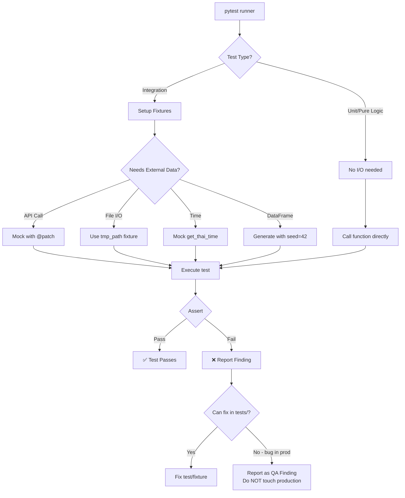

# เอกสาร QA: โฟลเดอร์ `test_data_engine`

---

## 1. Overview (ภาพรวม)

โฟลเดอร์ `tests/test_data_engine/` ทำหน้าที่เป็น **ชุดทดสอบหลักของชั้น Data Engine** ในโปรเจกต์นักขุดทอง ซึ่งเป็น AI Agent สำหรับซื้อขายทองคำแบบ Real-time บนแพลตฟอร์ม Aom NOW

ชั้น Data Engine เป็น **ฐานรากของทั้งระบบ** — ทุกการวิเคราะห์ที่ LLM (ReAct Loop) ทำจะอ้างอิงข้อมูลจากชั้นนี้ทั้งสิ้น ไม่ว่าจะเป็นราคาทอง ตัวชี้วัดเทคนิค หรือข่าวสาร ดังนั้นความน่าเชื่อถือของ Data Engine จึงส่งผลโดยตรงต่อ **คุณภาพของสัญญาณการซื้อขาย**

### วัตถุประสงค์หลัก

| วัตถุประสงค์ | รายละเอียด |
|------------|-----------|
| **Isolation** | แยก data pipeline ออกจาก LLM/UI layer — ทดสอบได้อิสระโดยไม่ต้องมี API key จริง |
| **Regression Guard** | ป้องกัน breaking changes ในฟังก์ชัน fetcher, indicator, parser ที่ใช้ใน production |
| **Contract Validation** | ตรวจสอบว่า output format (dict keys, data types) ตรงตาม schema ที่ LLM คาดหวัง |
| **Edge Case Coverage** | ครอบคลุมกรณีเครือข่ายล้มเหลว, ข้อมูลหายไป, ค่า boundary, และตลาดผิดปกติ |
| **API Isolation** | ไม่มี network call จริงในชุดทดสอบ — ทุก external API ถูก mock ทั้งหมด |

### สถิติรวม

| เมตริก | จำนวน |
|--------|-------|
| Test Files | 13 ไฟล์ |
| Test Classes | 85+ คลาส |
| Test Functions | 300+ ฟังก์ชัน |
| Fixtures | 40+ รายการ |
| Mock/Patch Instances | 50+ จุด |
| Production Modules Tested | 20+ โมดูล |
| `@pytest.mark.data_engine` markers | 13 ไฟล์ (ทุกไฟล์) |
| Parametrized Test Blocks | 15+ บล็อก |

---

## 2. Directory Structure & Coverage (โครงสร้างและ Coverage Map)

### โครงสร้างโฟลเดอร์

```
tests/test_data_engine/
│
├── test_conJSON.py              # ทดสอบ JSON export utility
├── test_extract_features.py     # ทดสอบ ML feature extraction pipeline
├── test_fetcher.py              # ทดสอบ GoldDataFetcher (price aggregator)
├── test_fundamental_tools.py    # ทดสอบ fundamental analysis tools
├── test_gold_interceptor.py     # ทดสอบ WebSocket message parser
├── test_indicators.py           # ทดสอบ TechnicalIndicators (RSI/MACD/BB/ATR)
├── test_newsfetcher.py          # ทดสอบ GoldNewsFetcher + sentiment
├── test_ohlcv_fetcher.py        # ทดสอบ OHLCV fetcher + validation
├── test_orchestrator.py         # ทดสอบ GoldTradingOrchestrator (main coordinator)
├── test_schema_validator.py     # ทดสอบ market state schema validator
├── test_technical_tools.py      # ทดสอบ technical analysis tools (S/R, divergence)
├── test_thailand_timestamp.py   # ทดสอบ Thai timezone utilities
├── test_tool_result_scorer.py   # ทดสอบ ToolResultScorer (LLM quality gate)
└── about-test_data_engine.md    # เอกสารนี้
```

### Coverage Map (Test File → Production Module)

```
Production Module                                    ← Test File
─────────────────────────────────────────────────────────────────────────────
data_engine/orchestrator.py                          ← test_orchestrator.py
data_engine/fetcher.py                               ← test_fetcher.py
data_engine/indicators.py                            ← test_indicators.py
data_engine/newsfetcher.py                           ← test_newsfetcher.py
data_engine/ohlcv_fetcher.py                         ← test_ohlcv_fetcher.py
data_engine/thailand_timestamp.py                    ← test_thailand_timestamp.py
data_engine/extract_features.py                      ← test_extract_features.py
data_engine/gold_interceptor_lite.py                 ← test_gold_interceptor.py
data_engine/tools/schema_validator.py                ← test_schema_validator.py
data_engine/tools/tool_result_scorer.py              ← test_tool_result_scorer.py
data_engine/analysis_tools/technical_tools.py        ← test_technical_tools.py
data_engine/analysis_tools/fundamental_tools.py      ← test_fundamental_tools.py
data_engine/conJSON.py (inline reimplementation)     ← test_conJSON.py
```

---

## 3. What is Being Tested — Key Scenarios (สิ่งที่ทดสอบในแต่ละไฟล์)

### 3.1 `test_conJSON.py` — JSON Export Logic

**โมดูลที่ทดสอบ:** JSON export specification (inline reimplementation — `conJSON.py` ไม่มีอยู่ใน codebase แล้ว logic ถูกรวมเข้าใน orchestrator)

| Scenario | ประเภท | รายละเอียด |
|----------|--------|-----------|
| สร้างไฟล์ JSON ได้จริง | Happy Path | ตรวจว่า export สร้าง file ใน path ที่กำหนด |
| JSON ถูกต้องตาม spec | Contract | indent=4, ensure_ascii=False, UTF-8 |
| รองรับอักษรไทย | Edge Case | Thai characters ไม่ถูก escape เป็น `\uXXXX` |
| ชื่อไฟล์มี timestamp | Format | ตรวจ prefix `gold_data_` + timestamp |
| สร้าง nested directory | File I/O | ใช้ `os.makedirs(exist_ok=True)` |
| Handle non-serializable | Edge Case | ค่าที่ JSON ไม่รองรับต้องไม่ crash |

> **หมายเหตุ:** `conJSON.py` ไม่มีอยู่ใน codebase (โมดูลถูก inline เข้า orchestrator แล้ว) การทดสอบด้วย inline reimplementation เป็น **intentional design** — ทดสอบ JSON export spec ไม่ใช่ module implementation

---

### 3.2 `test_extract_features.py` — ML Feature Extraction

**โมดูลที่ทดสอบ:** `data_engine/extract_features.py::build_feature_dataset()`

| Scenario | ประเภท | รายละเอียด |
|----------|--------|-----------|
| สร้าง CSV file ได้ | Happy Path | ตรวจว่า output CSV มีอยู่จริง |
| columns ครบถ้วน | Contract | ครอบคลุมทุก feature column |
| Append mode | Data Flow | เพิ่มแถวต่อจาก CSV เดิมได้ (ไม่ overwrite) |
| Missing JSON → None | Negative | ไฟล์ input หายไป → return None ไม่ crash |
| Session detection | Business Logic | Asian (10:00), London (16:00), NY (21:00) |
| Session overlap | Edge Case | NY+London overlap ตรวจจับได้ถูกต้อง |
| Trend encoding | Business Logic | uptrend=1, downtrend=-1, sideways=0, unknown=0 |
| Sentiment averaging | Business Logic | คำนวณ avg sentiment per category ถูกต้อง |
| Empty news → 0.0 | Edge Case | ไม่มีบทความ → sentiment = 0.0 |

---

### 3.3 `test_fetcher.py` — Gold Data Aggregator

**โมดูลที่ทดสอบ:** `data_engine/fetcher.py::GoldDataFetcher`

| Scenario | ประเภท | รายละเอียด |
|----------|--------|-----------|
| `compute_confidence()` empty | Edge Case | ส่ง [] → confidence = 0 |
| `compute_confidence()` identical | Edge Case | ราคาเท่ากันทุกแหล่ง → confidence = 1.0 |
| `compute_confidence()` divergent | Edge Case | แหล่งต่างกันมาก → confidence ต่ำ |
| confidence ไม่ติดลบ | Boundary | ต่ำสุดที่ 0.0 เสมอ |
| Thai gold fallback calc | Business Logic | ไม่มีไฟล์ JSON → คำนวณจาก spot price |
| Thai gold rounded to 50 | Format | ราคา THB rounded ทีละ 50 |
| Thai gold sell > buy | Contract | spread เป็นบวกเสมอ |
| All APIs fail → {} | Negative | ทุก source fail → dict ว่าง |
| USD/THB hardcoded fallback | Fallback | API ล้มเหลว → ใช้ค่า hardcoded |
| `fetch_all()` keys ครบ | Contract | return dict มี key ครบตาม spec |

**Mock ที่ใช้:**

```python
@patch("data_engine.fetcher.os.path.exists")         # mock file system
@patch("data_engine.fetcher.os.getenv")               # mock API keys
@patch("data_engine.fetcher.get_thai_time")           # mock time
patch.dict("sys.modules", {"yfinance": MagicMock()}) # mock library
```

---

### 3.4 `test_fundamental_tools.py` — Fundamental Analysis Tools

**โมดูลที่ทดสอบ:** `data_engine/analysis_tools/fundamental_tools.py`

**Markers:** `pytestmark = pytest.mark.data_engine`

#### `_compute_news_relevance()`

| Scenario | ประเภท | รายละเอียด |
|----------|--------|-----------|
| บทความทุกชิ้นตรง | Happy Path | relevance = 1.0 |
| บางชิ้นตรง | Calculation | 3/5 match = 0.6 |
| ไม่มีบทความ | Edge Case | relevance = 0.0 |
| หมวดไม่รู้จัก | Fallback | relevance = 0.5 (default) |
| Case-insensitive | Edge Case | "Gold" matches "gold" |
| 8 หมวดข่าว | Parametrize | gold_price, fed_policy, inflation, geopolitics, ... |
| Match ผ่าน summary field | Edge Case | keyword อยู่ใน summary ไม่ใช่ title |

#### `check_upcoming_economic_calendar()`

| Scenario | ประเภท | รายละเอียด |
|----------|--------|-----------|
| Network error | Negative | ConnectionError → return error dict |
| HTTP error | Negative | HTTPError → return error dict |
| USD High impact ≤2h | Critical | risk_level = "critical", is_safe_to_trade = False |
| USD High impact >2h | High | risk_level = "high" |
| Non-USD High impact | Medium | risk_level = "medium" |
| Irrelevant currencies | Low | NZD, AUD ignored → "low" |
| Events capped at 15 | Boundary | Output ไม่เกิน 15 events |
| Invalid date | Edge Case | silently skipped, ไม่ crash |

> **หมายเหตุ:** `is_safe_to_trade = False` จาก economic calendar จะทำให้ `ToolResultScorer` ออก **HARD BLOCK** ทันที — ห้ามซื้อขายในช่วงนั้น

---

### 3.5 `test_gold_interceptor.py` — WebSocket Protocol Spec

**โมดูลที่ทดสอบ:** `data_engine/gold_interceptor_lite.py` (inline reimplementation ของ parsing spec)

| Scenario | ประเภท | รายละเอียด |
|----------|--------|-----------|
| Valid "42[...]" message | Happy Path | Parse WS message format ได้ถูกต้อง |
| ไม่ใช่ prefix "42" | Negative | Reject → return None |
| Non-gold event | Negative | Event ที่ไม่ใช่ updateGoldRateData → skip |
| Invalid JSON | Edge Case | ไม่ crash → return None |
| Empty string | Edge Case | ไม่ crash |
| All fields extracted | Contract | bid, ask, symbol, timestamp สกัดได้ครบ |
| Missing fields → default | Edge Case | ค่าที่หายไป → None หรือ 'Unknown' |
| Zero bid → None payload | Validation | ราคา 0 = invalid → payload = None |
| CSV headers ถูกต้อง | Contract | ตรวจ column headers ที่คาดไว้ |

---

### 3.6 `test_indicators.py` — Technical Indicators

**โมดูลที่ทดสอบ:** `data_engine/indicators.py::TechnicalIndicators`

#### Fixtures สำคัญ

```python
@pytest.fixture def ohlcv_df()       # 300-row standard market data (seed=42)
@pytest.fixture def uptrend_df()     # Strong uptrend (trend multiplier=2.0)
@pytest.fixture def downtrend_df()   # Strong downtrend (trend=-2.0)
@pytest.fixture def flat_df()        # Flat/sideways (noise=0.001)
```

| Module | Scenario | รายละเอียด |
|--------|----------|-----------|
| Init | Empty DataFrame | ValueError ต้อง raise |
| Init | Missing 'close' column | ValueError ต้อง raise |
| Init | ไม่ mutate input | ใช้ .copy() — ตัวแปรเดิมไม่เปลี่ยน |
| RSI | Range 0-100 | ทุก row อยู่ใน 0-100 เสมอ |
| RSI | Overbought in uptrend | RSI > 70 ใน strong uptrend |
| RSI | Oversold in downtrend | RSI < 30 ใน strong downtrend |
| MACD | histogram = line - signal | ตรวจสูตรตรงๆ |
| Bollinger | upper > middle > lower | Band ordering |
| ATR | Near zero on flat market | ATR < 0.1 เมื่อตลาด flat |
| Trend | EMA20 > EMA50 = uptrend | Golden cross logic |
| Edge | Constant price | ทุก indicator ไม่ crash |
| Edge | Reproducibility | seed=42 → ผลเหมือนกันทุกครั้ง |
| Reliability | Sideways market warning | flat market → `reliability_warnings` มีข้อความเตือน |

---

### 3.7 `test_newsfetcher.py` — News Fetcher & Sentiment

**โมดูลที่ทดสอบ:** `data_engine/newsfetcher.py`

| Scenario | ประเภท | รายละเอียด |
|----------|--------|-----------|
| `NewsArticle` default sentiment | Contract | sentiment = 0.0 ถ้าไม่ได้ set |
| Token estimation proportional | Logic | title ยาวขึ้น → estimated_tokens มากขึ้น |
| Score sentiment ไม่มี token | Negative | HF_TOKEN=None → return zeros ทุก article |
| Token budget enforcement | Boundary | เกิน budget → ตัด articles ออก |
| Count limit enforcement | Boundary | เกิน max_articles → ตัดออก |
| yfinance parse: missing title | Negative | ไม่มี title → return None |
| yfinance parse: invalid URL | Negative | URL ผิดรูปแบบ → return None |
| NEWS_CATEGORIES schema | Contract | ทุกหมวดต้องมี impact + priority |

---

### 3.8 `test_ohlcv_fetcher.py` — OHLCV Data Fetcher

**โมดูลที่ทดสอบ:** `data_engine/ohlcv_fetcher.py`

| Scenario | ประเภท | รายละเอียด |
|----------|--------|-----------|
| Naive index → UTC | Timezone | ไม่มี timezone info → assume UTC |
| Bangkok → UTC | Timezone | แปลง Asia/Bangkok → UTC (-7h) |
| Already UTC → unchanged | Timezone | ไม่ double-convert |
| Empty cache → full fetch | Optimization | ไม่มี cache → ดึงข้อมูลเต็ม |
| Fresh cache → reduce days | Optimization | มีข้อมูลใหม่ → ดึงน้อยลง |
| Stale cache → full fetch | Optimization | ข้อมูลเก่าเกินไป → refresh ทั้งหมด |
| Remove high < low candles | Validation | candle ผิดปกติถูกลบออก |
| Remove negative prices | Validation | ราคาติดลบถูกลบออก |
| Remove NaN prices | Validation | NaN ถูกลบออก |
| String → numeric coerce | Validation | string "3200.5" → float 3200.5 |
| Retry on failure | Resilience | exception → retry N ครั้ง |
| All retries fail | Negative | raise exception ขึ้นมา |

---

### 3.9 `test_orchestrator.py` — Main Orchestrator

**โมดูลที่ทดสอบ:** `data_engine/orchestrator.py::GoldTradingOrchestrator`

| Scenario | ประเภท | รายละเอียด |
|----------|--------|-----------|
| `run()` payload keys ครบ | Contract | meta, data_quality, market_data, technical_indicators, news |
| Meta fields ถูกต้อง | Contract | run_id, timestamp, interval มีครบ |
| บันทึก JSON file | File I/O | `latest.json` ถูกสร้างใน output_dir |
| Override history_days | Config | runtime override ทำงานได้ |
| Missing OHLCV data | Degradation | ไม่มี OHLCV → payload ยังคืนมาได้ (degraded quality) |

**Mock Strategy:**

```python
@patch("data_engine.orchestrator.start_interceptor_background")  # ไม่เปิด WS จริง
@patch("data_engine.orchestrator.call_tool", side_effect=mock_fn) # mock ทุก tool call
@patch("data_engine.orchestrator.validate_market_state")          # ข้าม validation
@patch("data_engine.orchestrator.get_thai_time")                  # deterministic time
```

---

### 3.10 `test_schema_validator.py` — Market State Schema

**โมดูลที่ทดสอบ:** `data_engine/tools/schema_validator.py::validate_market_state()`

**Markers:** `pytestmark = pytest.mark.data_engine`

**4 Required Fields ที่ตรวจสอบ:**

1. `market_data.spot_price_usd`
2. `market_data.thai_gold_thb.sell_price_thb`
3. `market_data.thai_gold_thb.buy_price_thb`
4. `technical_indicators.rsi.value`

| Scenario | ประเภท | รายละเอียด |
|----------|--------|-----------|
| Valid state → [] | Happy Path | ไม่มี error |
| Empty dict → 4 errors | Negative | ขาดทุก field |
| แต่ละ field ขาดแยกกัน | Parametrize | Parametrized บน REQUIRED_FIELDS |
| None value → ผ่าน | Edge Case | ค่า None ที่ leaf node ถือว่าใช้ได้ |
| Extra fields → ไม่มี error | Edge Case | field เพิ่มเติมไม่ทำให้ผิด |
| Error message มี dotted path | Format | เช่น "missing: market_data.spot_price_usd" |

---

### 3.11 `test_technical_tools.py` — Advanced Technical Tools

**โมดูลที่ทดสอบ:** `data_engine/analysis_tools/technical_tools.py`

**Markers:** `pytestmark = pytest.mark.data_engine`

| Function | Scenario | รายละเอียด |
|----------|----------|-----------|
| `check_spot_thb_alignment` | Strong Bullish | USD ขึ้น + THB ขึ้นพร้อมกัน |
| `check_spot_thb_alignment` | Divergence | ขึ้นทางเดียว → Neutral |
| `detect_breakout_confirmation` | Confirmed breakout | close เกิน zone + body แข็งแรง |
| `detect_breakout_confirmation` | Doji → no confirm | open==close → no confirmation |
| `detect_breakout_confirmation` | Wick-heavy → no confirm | body เล็กเกินไป |
| `get_support_resistance_zones` | 300 rows normal | Zones มี type, bottom, top, touches, strength |
| `get_support_resistance_zones` | ไม่พอ 50 rows | return error |
| `detect_rsi_divergence` | Flat price → no divergence | ไม่มี swing → False |
| `get_htf_trend` | Cache hit | call ครั้ง 2 → ใช้ cached result |
| `get_htf_trend` | Stale cache (>1800s) | TTL หมด → refresh |
| `calculate_ema_distance` | Overextended | distance > 5.0 ATR → is_overextended=True |

**Autouse Fixture:**

```python
@pytest.fixture(autouse=True)
def clear_htf_cache():
    """Clear HTF trend cache between tests to prevent state leak."""
```

---

### 3.12 `test_thailand_timestamp.py` — Timezone Utilities

**โมดูลที่ทดสอบ:** `data_engine/thailand_timestamp.py`

| Scenario | ประเภท | รายละเอียด |
|----------|--------|-----------|
| `get_thai_time()` มี timezone | Contract | tzinfo ไม่ใช่ None |
| `get_thai_time()` = Bangkok | Contract | timezone = Asia/Bangkok |
| Naive index → assume UTC → Bangkok | Conversion | UTC+0 → UTC+7 (+7h) |
| US/Eastern → Bangkok | Conversion | แปลงข้ามทวีปถูกต้อง |
| Length preserved | Contract | แปลง timezone ไม่เปลี่ยนจำนวนแถว |
| Unix timestamp (int) | Format | แปลงได้ถูกต้อง |
| ISO 8601 string | Format | "2024-01-15T10:00:00" แปลงได้ |
| Empty string → ValueError | Negative | raise ValueError |
| None → ValueError/TypeError | Negative | raise exception |
| NaN → ValueError | Negative | raise ValueError |

---

### 3.13 `test_tool_result_scorer.py` — ToolResult Quality Gate

**โมดูลที่ทดสอบ:** `data_engine/tools/tool_result_scorer.py::ToolResultScorer`

**Markers:** `pytestmark = pytest.mark.data_engine`

นี่คือไฟล์ทดสอบที่ใหญ่และซับซ้อนที่สุด ครอบคลุม scoring algorithm ของ LLM quality gate

#### Scoring Rules ที่ตรวจสอบ

| Tool | Score Rules | Parametrize |
|------|------------|-------------|
| Breakout confirmed + strong body | 0.95 (+0.10 bonus) | - |
| Breakout confirmed + normal body | 0.85 | - |
| BB+RSI Combo detected | 0.85 | - |
| EMA overextended + far (>7.5 ATR) | 0.90 (+0.15 bonus) | - |
| EMA overextended + normal | 0.75 | - |
| S/R Zone: nearby Low/Medium/High | 0.6 / 0.75 / 0.9 | ✓ Parametrize |
| HTF trend bullish far from EMA | 0.75 | - |
| Economic calendar risk | critical=1.0, high=0.8, medium=0.5 | ✓ Parametrize |
| Deep news: blended score | 0.7×count + 0.4×relevance | ✓ Parametrize |
| Intermarket: 2 warnings | 1.0 | - |
| Intermarket: 1 warning | 0.75 | - |
| Error output | 0.0 (any tool) | - |
| FLOOR_SCORE | 0.2 (non-critical result) | - |

#### HARD BLOCK Logic

```
ถ้า tool.output["is_safe_to_trade"] == False
  → hard_block = True
  → should_proceed = False  (override ทุก score อื่น)
  → reason มี tool_name + action
```

#### Weighted Average

```
avg = Σ(score × weight) / Σ(weight)
should_proceed = avg >= 0.6  (PROCEED_THRESHOLD)
```

#### Recommendation Engine

- Score < 0.6 → สร้าง recommendations สำหรับ tools ที่ควรลองต่อ
- `get_deep_news_by_category` ที่ score ต่ำ → แนะนำ category ถัดไปที่ยังไม่ได้ดึง
- ครบ 8 categories แล้ว → ไม่มี recommendation (exhausted)

---

## 4. Testing Flow — Data Engine QA Architecture

### Lifecycle ของ 1 Test



### Mock Architecture — ชั้นการ Isolate

```
┌─────────────────────────────────────────────────────────┐
│                   TEST BOUNDARY                         │
│                                                         │
│  test_*.py                                              │
│      │                                                  │
│      ├── @patch "requests.get"  ←── HTTP calls blocked  │
│      ├── @patch "os.getenv"     ←── API keys blocked    │
│      ├── @patch "get_thai_time" ←── Time deterministic  │
│      ├── @patch "call_tool"     ←── Tool calls mocked   │
│      └── tmp_path fixture       ←── Real files in temp  │
│                                                         │
│  Production Code (Read-Only)                            │
│      └── Pure business logic runs as-is                 │
│                                                         │
└─────────────────────────────────────────────────────────┘
              ↓ NOTHING REACHES ↓
         ┌──────────────────────┐
         │  External Services   │
         │  • TwelveData API    │
         │  • yfinance          │
         │  • HuggingFace       │
         │  • ForexFactory      │
         │  • HSH WebSocket     │
         └──────────────────────┘
```

### Data Flow ในชุดทดสอบ Orchestrator

```
test_orchestrator.py
    │
    ├── Fixture: _mock_ohlcv_df()          → สร้าง OHLCV DataFrame ปลอม
    ├── Fixture: _mock_call_tool()         → mock tool dispatcher
    │
    └── @patch start_interceptor_background → ไม่เปิด WebSocket จริง
        @patch validate_market_state        → ข้าม validation
        @patch call_tool                    → ใช้ mock data
        @patch get_thai_time                → deterministic timestamp
            │
            └── GoldTradingOrchestrator.run()
                    │
                    ├── "fetch_price" tool → _mock_call_tool() returns fake price
                    ├── "fetch_indicators" → returns fake indicators
                    └── "fetch_news"       → returns fake news
                            │
                            └── _assemble_payload() → ตรวจ output structure
```

---

## 5. QA Standards & Conventions (มาตรฐาน QA)

### 5.1 Pytest Markers

ทุก test ต้องมี marker ที่เหมาะสม:

| Marker | ใช้เมื่อ | ตัวอย่าง |
|--------|---------|---------|
| `@pytest.mark.data_engine` | ทุก test ใน test_data_engine/ (ทุก 13 ไฟล์) | ทุกไฟล์ |
| `@pytest.mark.unit` | Pure logic, ไม่มี I/O | ฟังก์ชัน utility |
| `@pytest.mark.integration` | ข้าม module boundary | orchestrator tests |
| `@pytest.mark.slow` | นานกว่า 5 วินาที | ต้องระบุ |
| `@pytest.mark.llm` | ต้องการ API key จริง | ไม่มีใน folder นี้ |

```python
# ✅ ถูกต้อง — module-level marker
pytestmark = pytest.mark.data_engine

# ✅ ถูกต้อง — function-level
@pytest.mark.data_engine
@pytest.mark.parametrize("risk_level,expected", [...])
def test_score_by_risk_level(risk_level, expected):
    ...
```

### 5.2 Fixture Scope Rules

| Scope | ใช้เมื่อ | ตัวอย่าง |
|-------|---------|---------|
| `scope="module"` | Object ที่ expensive สร้าง + stateless | `scorer = ToolResultScorer()` |
| `scope="function"` (default) | Object ที่มี state หรือ mutate | `portfolio`, `fetcher` |
| `autouse=True` | Setup/teardown ที่จำเป็นทุก test | `clear_htf_cache` |

```python
# ✅ Module scope — scorer stateless
@pytest.fixture(scope="module")
def scorer():
    """Shared ToolResultScorer instance (stateless)."""
    return ToolResultScorer()

# ✅ Function scope — fetcher มี state
@pytest.fixture
def fetcher():
    """Fresh GoldDataFetcher per test."""
    return GoldDataFetcher()

# ✅ Autouse — ล้าง cache อัตโนมัติ
@pytest.fixture(autouse=True)
def clear_htf_cache():
    """Clear HTF trend cache before each test."""
    # clear logic here
    yield
```

### 5.3 Mock & Patch Rules

**ข้อกำหนดเด็ดขาด:** ห้าม network call จริงในทุก test

```python
# ✅ ถูกต้อง — patch at the import location
@patch("data_engine.fetcher.requests.Session")
def test_fetch_usd_thb_success(mock_session):
    mock_resp = MagicMock()
    mock_resp.json.return_value = {"rates": {"THB": 35.5}}
    mock_session.return_value.__enter__.return_value.get.return_value = mock_resp
    ...

# ✅ ถูกต้อง — patch sys.modules สำหรับ optional import
with patch.dict("sys.modules", {"yfinance": MagicMock()}):
    ...

# ❌ ผิด — เรียก API จริง
def test_fetch_price_real():
    result = GoldDataFetcher().fetch_gold_spot_usd()  # ❌ network call!
```

### 5.4 Parametrize Rules

ใช้ `pytest.mark.parametrize` แทนการ copy-paste test function:

```python
# ✅ ถูกต้อง — 1 test ครอบคลุมหลาย case
@pytest.mark.parametrize("risk_level,expected_score", [
    ("critical", 1.0),
    ("high",     0.8),
    ("medium",   0.5),
    ("low",      FLOOR_SCORE),
])
def test_score_by_risk_level(make_result, scorer, risk_level, expected_score):
    """Verify economic calendar risk level maps to correct score."""
    result = make_result("check_upcoming_economic_calendar",
                         {"risk_level": risk_level, "is_safe_to_trade": True})
    report = scorer.score([result])
    assert abs(report.tool_scores[0].score - expected_score) < 0.01

# ❌ ผิด — copy-paste 4 functions แยกกัน
def test_critical(): ...
def test_high(): ...
def test_medium(): ...
def test_low(): ...
```

### 5.5 Assertion Quality

```python
# ✅ ถูกต้อง — assert ค่าที่เฉพาะเจาะจง + error message
assert report.avg_score == pytest.approx(0.85, abs=0.01), \
    f"Expected 0.85 but got {report.avg_score}"

# ✅ ถูกต้อง — assert range
assert 0.0 <= rsi_value <= 100.0, f"RSI out of range: {rsi_value}"

# ❌ ผิด — too vague
assert result is not None
assert result  # truthy check only
```

### 5.6 Docstring Requirement

ทุก test function ต้องมี docstring อธิบาย:

```python
def test_hard_block_overrides_high_avg_score(make_result, scorer):
    """
    Verify that hard_block=True forces should_proceed=False even when
    the weighted average score would normally be high enough to proceed.

    Business reason: Economic calendar CRITICAL events must halt trading
    regardless of technical signal quality.
    """
    ...
```

### 5.7 Negative & Edge Case Requirement

ทุก test file ต้องมีอย่างน้อย 1 negative test:

```python
# ✅ Negative test examples ที่มีอยู่
def test_all_apis_fail_returns_empty():      # test_fetcher.py
def test_missing_json_returns_none():         # test_extract_features.py
def test_network_error_returns_error_dict():  # test_fundamental_tools.py
def test_empty_string_raises():               # test_thailand_timestamp.py
def test_missing_title_returns_none():        # test_newsfetcher.py
```

---

## 6. How to Run (วิธีรัน)

**ทุกคำสั่งรันจาก directory `Src/`**

### รัน test_data_engine ทั้งหมด

```bash
cd Src

# รัน test_data_engine ทั้งโฟลเดอร์
pytest tests/test_data_engine/ -v

# รันเฉพาะ marker data_engine (ครอบคลุม 5 ไฟล์ที่มี marker)
pytest -m data_engine -v
```

### รันไฟล์เดียว

```bash
# เลือกไฟล์ที่ต้องการ
pytest tests/test_data_engine/test_indicators.py -v
pytest tests/test_data_engine/test_tool_result_scorer.py -v
pytest tests/test_data_engine/test_technical_tools.py -v
```

### รัน test เดียว

```bash
# เฉพาะ class
pytest tests/test_data_engine/test_indicators.py::TestRSI -v

# เฉพาะ function
pytest tests/test_data_engine/test_indicators.py::TestRSI::test_rsi_overbought_in_uptrend -v

# เฉพาะ parametrize case
pytest "tests/test_data_engine/test_tool_result_scorer.py::TestScoreEconomicCalendar::test_score_by_risk_level[critical-1.0]" -v
```

### รันพร้อม Coverage Report

```bash
# HTML report (เปิดที่ test_reports/report.html)
pytest tests/test_data_engine/ --html=test_reports/report.html -v

# Coverage report
pytest tests/test_data_engine/ --cov=data_engine --cov-report=html -v

# Coverage พร้อม branch analysis
pytest tests/test_data_engine/ \
  --cov=data_engine \
  --cov-report=html:test_reports/coverage \
  --cov-branch \
  -v
```

### Dry Run (ดู test list โดยไม่รัน)

```bash
pytest tests/test_data_engine/ --collect-only
```

### รันแบบ parallel (ต้องติดตั้ง pytest-xdist)

```bash
pytest tests/test_data_engine/ -n auto -v
```

### Filter โดย keyword

```bash
# รันเฉพาะ test ที่ชื่อมีคำว่า "error"
pytest tests/test_data_engine/ -k "error" -v

# รันเฉพาะ test ที่ไม่ใช่ slow
pytest tests/test_data_engine/ -k "not slow" -v
```

---

## Appendix: QA Notes & Design Decisions

| รายการ | ไฟล์ | สถานะ | รายละเอียด |
|--------|------|-------|-----------|
| Inline reimplementation ของ JSON export spec | `test_conJSON.py` | ✅ By Design | `conJSON.py` ไม่มีใน codebase แล้ว — ทดสอบ spec โดยตรงด้วย inline function เป็น approach ที่ถูกต้อง |
| Inline reimplementation ของ WebSocket parsing | `test_gold_interceptor.py` | ✅ By Design | `gold_interceptor_lite.py` import ได้ปลอดภัย แต่ parsing logic ฝังอยู่ใน `run_intergold_fallback()` ไม่มี function แยก → inline reimplementation ของ protocol spec เป็น approach ที่ถูกต้อง |
| `@pytest.mark.data_engine` ทุก 13 ไฟล์ | ทุก test file | ✅ แก้ไขแล้ว | เพิ่ม `pytestmark = pytest.mark.data_engine` ครบทุกไฟล์แล้ว |

> **กฎ QA:** ถ้า production code มี bug ที่ต้องแก้เพื่อให้ test ผ่าน — **รายงานเป็น finding** อย่าแก้ไฟล์ production เอง

---


