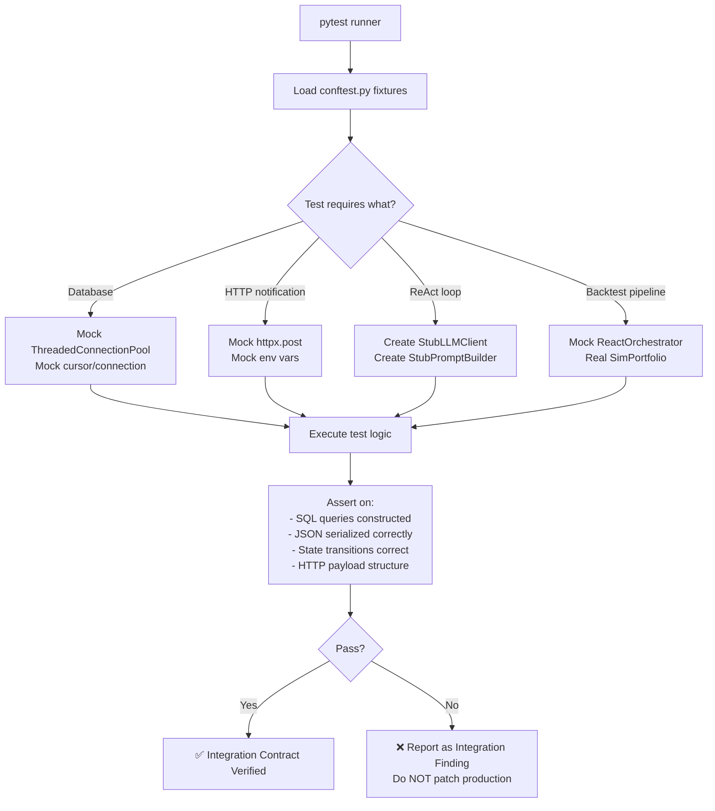

# เอกสาร QA: โฟลเดอร์ `test_integration`

---

## 1. Overview (ภาพรวม)

โฟลเดอร์ `tests/test_integration/` ทำหน้าที่ตรวจสอบ **การทำงานร่วมกันระหว่าง module** ในโปรเจกต์นักขุดทอง โดยเน้นที่จุดเชื่อมต่อ (boundary) ระหว่างชั้นต่างๆ ของระบบ ได้แก่ ReAct loop, Database, Notification, และ Backtest Pipeline

### ความแตกต่างระหว่าง Unit Tests และ Integration Tests

| มิติ | Unit Tests | Integration Tests |
|------|-----------|-------------------|
| **ขอบเขต** | 1 function / 1 class | หลาย module ทำงานร่วมกัน |
| **Mock Strategy** | Mock ทุก dependency | Mock เฉพาะ external I/O (HTTP, LLM API) |
| **ความเร็ว** | เร็วมาก (< 1ms/test) | ช้ากว่า (setup/teardown หนักกว่า) |
| **จุดที่ตรวจสอบ** | Pure logic, สูตรคำนวณ | Data flow ข้ามโมดูล, state transitions |
| **Database** | Mock cursor/pool | Mocked pool แต่ตรวจ SQL และ JSON logic จริง |
| **วัตถุประสงค์** | ยืนยัน algorithm | ยืนยัน contract ระหว่าง component |

### สิ่งที่ Integration Tests ตรวจสอบ

```
ระดับการ Mock (น้อย → มาก)
─────────────────────────────────────────────────────
Unit Tests    │ Mock ทุกอย่าง ยกเว้น function ที่ทดสอบ
              │
Integration   │ Mock เฉพาะ network จริง (LLM API, Telegram, Discord,
Tests         │ PostgreSQL pool) — ปล่อยให้ business logic ทำงานจริง
              │
E2E Tests     │ ไม่ Mock อะไรเลย (ต้องการ API keys ทั้งหมด)
─────────────────────────────────────────────────────
```

### สถิติรวม

| เมตริก | จำนวน |
|--------|-------|
| Test Files | 6 ไฟล์ |
| Test Classes | 80+ คลาส |
| Test Functions | 400+ ฟังก์ชัน |
| Production Modules Tested | 6+ โมดูลหลัก |
| Marker `@pytest.mark.integration` | 6 ไฟล์ (ทุกไฟล์) |

---

## 2. Directory Structure & Component Coverage (โครงสร้างและ Coverage Map)

### โครงสร้างโฟลเดอร์

```
tests/test_integration/
│
├── test_backtest_pipeline.py    # Backtest pipeline: MarketState, Portfolio, Cache
├── test_database.py             # RunDatabase: SQL logic, JSON serialization
├── test_database_robustness.py  # RunDatabase: error handling, connection cleanup
├── test_discord_notifier.py     # DiscordNotifier: guard chain, embed building, HTTP
├── test_react.py                # ReactOrchestrator: ReAct loop, RiskManager, tools
├── test_telegram_notifier.py    # TelegramNotifier: guard chain, message building, HTTP
└── about-test_integration.md    # เอกสารนี้
```

### Component Coverage Map

```
Production Module                              ← Integration Test File
───────────────────────────────────────────────────────────────────────────────
agent_core/core/react.py (ReactOrchestrator)   ← test_react.py
agent_core/core/risk.py  (RiskManager)         ← test_react.py
database/database.py     (RunDatabase)         ← test_database.py
                                               ← test_database_robustness.py
notification/discord_notifier.py               ← test_discord_notifier.py
notification/telegram_notifier.py              ← test_telegram_notifier.py
backtest/engine/market_state_builder.py        ← test_backtest_pipeline.py
backtest/engine/portfolio.py (SimPortfolio)    ← test_backtest_pipeline.py
backtest/engine/news_provider.py               ← test_backtest_pipeline.py
backtest/run_main_backtest.py (MainPipeline)   ← test_backtest_pipeline.py
```

### Component Interaction Map

```
test_react.py
  StubLLMClient ──→ ReactOrchestrator ──→ RiskManager
                           │
                           └──→ Tool execution (inline test tools)

test_database.py
  MagicMock(pool) ──→ RunDatabase ──→ SQL logic ──→ JSON serialization

test_backtest_pipeline.py
  MarketStateBuilder ──→ SimPortfolio ──→ NullNewsProvider
         │                    │
         └──→ CandleCache      └──→ MainPipelineBacktest
                                         │
                                         └──→ MockReactOrchestrator

test_discord_notifier.py / test_telegram_notifier.py
  DiscordNotifier / TelegramNotifier ──→ GuardChain ──→ MagicMock(httpx)
         │
         └──→ build_embed() / build_message() ──→ Pure Logic (no mock)
```

---

## 3. Key Integration Scenarios (สิ่งที่ทดสอบ — สถานการณ์สำคัญ)

### 3.1 `test_react.py` — ReAct Loop + RiskManager Integration

**โมดูลที่เกี่ยวข้อง:** `agent_core/core/react.py`, `agent_core/core/risk.py`

**Strategy:** ใช้ **Stub classes** แทน unittest.mock (ไม่มี `@patch` เลย) เพื่อให้ ReactOrchestrator ทำงานจริงกับ LLM stub

```python
class StubLLMClient:
    """เลียนแบบ LLM client — คืน response ที่กำหนดไว้ล่วงหน้า"""

class StubPromptBuilder:
    """เลียนแบบ PromptBuilder — ไม่โหลด roles.json จริง"""
```

| Scenario | รายละเอียด |
|----------|-----------|
| Fast path (ตอบตรง) | LLM คืน decision โดยไม่เรียก tool → 1 iteration, 1 trace entry |
| Tool call → decision | LLM เรียก tool ก่อน → ดำเนินการ tool → คืน decision |
| Unknown tool | LLM เรียก tool ที่ไม่มี → graceful error, ไม่ crash |
| Tool exception | Tool throw exception → ถูก catch, ReAct loop ดำเนินต่อ |
| Max iterations | ถึง max_iterations → force fallback decision |
| **RiskManager reject** | confidence ต่ำ → RiskManager reject → ไม่ผ่าน risk check |
| **RiskManager pass** | confidence สูง → ผ่าน risk check → execute |
| Sell without gold | ไม่มีทองในพอร์ต → RiskManager block SELL signal |
| JSON extraction | parse `{"action": "BUY"}` จาก LLM text ทุกรูปแบบ (fenced code block, inline) |
| Trace aggregation | นับ tokens ทุก iteration, รวม prompt สุดท้าย |

> **จุดสำคัญ:** RiskManager ทำงานจริง (ไม่ mock) — integration ระหว่าง ReAct loop และ risk validation เป็นหัวใจของ test นี้

---

### 3.2 `test_database.py` — SQL Logic + JSON Serialization

**โมดูลที่เกี่ยวข้อง:** `database/database.py::RunDatabase`

**Strategy:** Mock `ThreadedConnectionPool` และ `psycopg2` cursor แต่ปล่อยให้ SQL query construction และ JSON serialization ทำงานจริง

| Scenario | รายละเอียด |
|----------|-----------|
| `save_run()` — basic | INSERT ถูกเรียกด้วย parameters ถูกต้อง |
| `save_run()` — JSON fields | `react_trace` และ `market_snapshot` ถูก serialize เป็น JSON string |
| `save_run()` — None values | ค่า None ใน market_state → SQL parameter เป็น None (ไม่ crash) |
| `save_run()` — commit | connection.commit() ถูกเรียกหลัง INSERT เสมอ |
| `get_recent_runs()` | query มี ORDER BY และ LIMIT |
| `get_run_detail()` | JSON fields ถูก parse กลับเป็น dict |
| `save_llm_log()` | trace_json (list) ถูก serialize, run_id อยู่ใน params |
| `save_llm_logs_batch()` | หลาย logs ถูกบันทึก, partial failure ไม่หยุด batch |
| `save_portfolio()` | UPSERT pattern (ON CONFLICT) |
| `get_portfolio()` | คืน default dict เมื่อ DB ว่าง |
| Signal stats | query มี COUNT, AVG aggregation |

---

### 3.3 `test_database_robustness.py` — Error Handling & Connection Lifecycle

**โมดูลที่เกี่ยวข้อง:** `database/database.py::RunDatabase`

| Scenario | ประเภท | รายละเอียด |
|----------|--------|-----------|
| Pool.getconn() fail | Connection Error | exception propagates ขึ้นมา (ไม่ถูก swallow) |
| cursor.execute() fail | Execute Error | ไม่ call commit() เมื่อ execute ล้มเหลว |
| connection.commit() fail | Commit Error | exception propagates |
| `save_run()` None react_trace | Null Safety | serialize None เป็น None (ไม่ crash) |
| Large JSON fields | Boundary | react_trace ขนาดใหญ่มาก → serialize สำเร็จ |
| putconn() called after success | Lifecycle | connection คืนสู่ pool เสมอ (ป้องกัน connection leak) |
| putconn() called after failure | Lifecycle | แม้ error → connection ถูกคืน pool (context manager) |

> **จุดสำคัญ:** ตรวจ connection lifecycle อย่างเข้มงวด — production system ที่ใช้ ThreadedConnectionPool ต้องคืน connection กลับ pool เสมอ ไม่งั้น pool หมดและระบบ hang

---

### 3.4 `test_discord_notifier.py` — Notification Guard Chain + Embed Building

**โมดูลที่เกี่ยวข้อง:** `notification/discord_notifier.py::DiscordNotifier`

**Strategy:** Mock `httpx.post` และ environment variables แต่ปล่อยให้ guard chain logic และ embed building ทำงานจริง

#### Guard Chain (Sequential Filter)

```
[enabled?] → [webhook_url set?] → [hold_filter?] → [min_confidence?] → [send]
```

| Scenario | Guard ที่ Block | รายละเอียด |
|----------|----------------|-----------|
| disabled | enabled=False | block ทันที |
| ไม่มี webhook URL | no_webhook | block |
| HOLD แต่ filter on | hold_filter | HOLD signal ถูก block |
| confidence ต่ำ | min_conf | confidence < threshold → block |
| ผ่านทุก guard | — | httpx.post() ถูกเรียก |

#### Full Pipeline Integration

| Scenario | รายละเอียด |
|----------|-----------|
| BUY signal end-to-end | guard pass → build_embed() → httpx.post() ด้วย payload ถูกต้อง |
| Multi-interval breakdown | หลาย interval results → embed มี breakdown section |
| Single interval | ไม่มี breakdown section (ไม่ต้องการ) |
| HTTP 4xx error | last_error ถูก set, return False |
| Network error | last_error ถูก set, return False |
| Runtime toggle | disable → enable → notify ทำงาน |

---

### 3.5 `test_telegram_notifier.py` — Telegram Message Building + Guard Chain

**โมดูลที่เกี่ยวข้อง:** `notification/telegram_notifier.py::TelegramNotifier`

**Strategy:** เช่นเดียวกับ Discord — mock httpx.post แต่ message building logic ทำงานจริง

| Scenario | รายละเอียด |
|----------|-----------|
| BUY/SELL/HOLD full flow | message ถูก build ด้วย HTML format, ส่งสำเร็จ |
| HTML escaping | rationale ที่มี `<`, `>`, `&` → escaped ก่อนส่ง |
| Rationale truncation | text > 800 chars → ตัดสั้นลง (ป้องกัน Telegram limit) |
| Degraded quality badge | quality_score="degraded" → badge ปรากฎใน message |
| Confidence bar | confidence 0.0–1.0 → text progress bar แสดงถูกต้อง |
| Runtime toggle | disable/enable → state เปลี่ยนและ notify ทำงานตาม state |
| HTTP 401/403/429/500 | แต่ละ error code → last_error set ถูกต้อง |
| Empty market state | ไม่มี market data → ไม่ crash |
| Missing voting keys | voting dict ไม่ครบ → ใช้ default ไม่ crash |

---

### 3.6 `test_backtest_pipeline.py` — Backtest Pipeline Integration

**โมดูลที่เกี่ยวข้อง:** `backtest/engine/market_state_builder.py`, `backtest/engine/portfolio.py`, `backtest/engine/news_provider.py`, `backtest/run_main_backtest.py`

**Strategy:** Mock `ReactOrchestrator` (LLM layer) ด้วย `MagicMock` แต่ปล่อยให้ SimPortfolio, MarketStateBuilder, CandleCache ทำงานจริง

| Scenario | รายละเอียด |
|----------|-----------|
| MarketState construction | `MarketStateBuilder.build()` คืน dict ที่มี keys ครบ (meta, market_data, technical_indicators, news, portfolio) |
| RSI overbought/oversold | indicators สะท้อน state จริง (RSI > 70 → overbought) |
| CandleCache: cache miss | key ไม่มีใน cache → Miss |
| CandleCache: cache hit | key เดิม → Hit, stats อัปเดต |
| Portfolio BUY → SELL flow | execute_buy() → execute_sell() → P&L ถูกต้อง |
| Outside session | signal ถูก skip เมื่ออยู่นอก trading session |
| Full pipeline run | `MainPipelineBacktest.run()` กับ mock LLM → สร้าง result_df, metrics, CSV |
| LLM error handled | mock LLM throw exception → pipeline ดำเนินต่อด้วย HOLD |
| Validation columns | result_df มี actual_direction, llm_correct, profitable columns |
| Metrics calculation | accuracy, precision, recall, buy_count, sell_count คำนวณถูกต้อง |

---

## 4. Integration Testing Flow (LifeCycle ของ Integration Test)

### Lifecycle ทั่วไป



### Mock Boundary Architecture

```
┌────────────────────────────────────────────────────────────────────┐
│                    INTEGRATION TEST SCOPE                          │
│                                                                    │
│  test_react.py                                                     │
│      StubLLMClient ──→ [ReactOrchestrator] ──→ [RiskManager]      │
│                              ↓                                     │
│                         Tool execution (inline stubs)             │
│                                                                    │
│  test_database.py                                                  │
│      MagicMock(pool) ──→ [RunDatabase] ──→ SQL/JSON logic          │
│                              ↓                                     │
│                         MagicMock(cursor)                         │
│                                                                    │
│  test_discord/telegram_notifier.py                                 │
│      [DiscordNotifier] ──→ [GuardChain] ──→ [build_embed()]        │
│                              ↓                                     │
│                         MagicMock(httpx.post)                     │
│                                                                    │
│  test_backtest_pipeline.py                                         │
│      MagicMock(ReactOrchestrator) ──→ [MarketStateBuilder]         │
│                                    ──→ [SimPortfolio]              │
│                                    ──→ [NullNewsProvider]          │
│                                    ──→ [CandleCache]               │
│                                                                    │
└────────────────────────────────────────────────────────────────────┘
              ↓ BLOCKED — ไม่ผ่าน boundary ↓
┌───────────────────────────────────┐
│        External Services          │
│  • PostgreSQL (real DB)           │ ← ThreadedConnectionPool mocked
│  • Gemini / Groq LLM APIs         │ ← StubLLMClient / MagicMock
│  • Discord Webhook                │ ← httpx.post mocked
│  • Telegram Bot API               │ ← httpx.post mocked
│  • TwelveData / yfinance          │ ← (handled in data_engine layer)
└───────────────────────────────────┘
```

### Database Test Setup Pattern

```python
# Pattern จาก test_database.py / test_database_robustness.py

@pytest.fixture
def mock_db(monkeypatch):
    """
    สร้าง RunDatabase instance ที่มี mocked DB pool
    — ทดสอบ SQL logic และ JSON serialization โดยไม่ต้องมี PostgreSQL จริง
    """
    mock_cursor = MagicMock()
    mock_conn = MagicMock()
    mock_conn.cursor.return_value.__enter__ = lambda s: mock_cursor
    mock_conn.cursor.return_value.__exit__ = MagicMock(return_value=False)
    mock_pool = MagicMock()
    mock_pool.getconn.return_value = mock_conn

    with patch("database.database.ThreadedConnectionPool", return_value=mock_pool):
        with patch.dict(os.environ, {"DATABASE_URL": "postgresql://test"}):
            db = RunDatabase()
            yield db, mock_cursor, mock_conn
```

### Stub LLM Pattern (test_react.py)

```python
# Pattern พิเศษ: ใช้ Stub class แทน MagicMock
# เพราะต้องการควบคุม response sequence

class StubLLMClient:
    def __init__(self, responses: list):
        self._responses = iter(responses)  # sequence ของ responses

    def generate(self, prompt, **kwargs) -> FakeLLMResponse:
        return next(self._responses)  # คืน response ตามลำดับ

# การใช้งาน:
stub = StubLLMClient([
    FakeLLMResponse(content='{"action": "TOOL", "tool": "fetch_rsi"}'),
    FakeLLMResponse(content='{"action": "BUY", "confidence": 0.82}'),
])
orchestrator = ReactOrchestrator(llm_client=stub, ...)
result = orchestrator.run(market_state)
# ตรวจว่า tool ถูกเรียก และ decision ถูกต้อง
```

---

## 5. QA Standards & Conventions (มาตรฐาน QA สำหรับ Integration Tests)

### 5.1 Marker Requirement

ทุก test ใน `test_integration/` ต้องมี `@pytest.mark.integration`:

```python
# ✅ ถูกต้อง — module-level marker (ครอบคลุมทุก test ในไฟล์)
pytestmark = pytest.mark.integration

# ✅ ถูกต้อง — function-level
@pytest.mark.integration
def test_react_loop_with_tool_call():
    ...

# ❌ ผิด — ไม่มี marker (ทำให้ไม่ถูกเลือกด้วย -m integration)
def test_something_important():
    ...
```

### 5.2 Mock Scope Rules — External vs Internal

**กฎหลัก:** Mock เฉพาะสิ่งที่อยู่นอก boundary ของระบบ

```python
# ✅ MOCK สิ่งเหล่านี้ (External boundaries)
@patch("notification.discord_notifier.httpx.post")      # Discord webhook
@patch("notification.telegram_notifier.httpx.post")     # Telegram API
@patch("database.database.ThreadedConnectionPool")      # PostgreSQL pool
@patch("agent_core.llm.client.LLMClientFactory")        # Gemini/Groq API

# ✅ ปล่อยให้ทำงานจริง (Internal logic)
ReactOrchestrator.run()         # ReAct loop
RiskManager.validate()          # Risk validation
DiscordNotifier._build_embed()  # Embed construction
RunDatabase._serialize_json()   # JSON handling
SimPortfolio.execute_buy()      # Portfolio math
MarketStateBuilder.build()      # Market state assembly

# ❌ ผิด — mock business logic (ทำให้ integration test ไม่มีความหมาย)
@patch("agent_core.core.risk.RiskManager.validate")     # ❌ ควรทำงานจริง
@patch("backtest.engine.portfolio.SimPortfolio.execute_buy")  # ❌ ควรทำงานจริง
```

### 5.3 Database Isolation Rules

Integration tests ต้องไม่กระทบ production database:

```python
# ✅ ถูกต้อง — Mock pool ทั้งหมด (ใช้กับ test_database.py)
with patch("database.database.ThreadedConnectionPool", return_value=mock_pool):
    with patch.dict(os.environ, {"DATABASE_URL": "postgresql://test_db"}):
        db = RunDatabase()
        # ทดสอบ SQL logic โดยไม่แตะ DB จริง

# ✅ ถูกต้อง — ถ้าต้องใช้ DB จริง ต้องใช้ test DB แยกต่างหาก
DATABASE_URL = os.getenv("TEST_DATABASE_URL", "postgresql://localhost/gold_trading_test")

# ❌ ผิด — ใช้ production DATABASE_URL โดยตรง
DATABASE_URL = os.getenv("DATABASE_URL")  # ❌ อาจแตะ prod DB
```

### 5.4 Fixture Scope สำหรับ Integration Tests

| Scope | ใช้เมื่อ | ตัวอย่างใน Codebase |
|-------|---------|-------------------|
| `scope="function"` (default) | Object ที่มี state หรือต้องการ clean state ทุก test | `mock_db` fixture |
| `scope="module"` | Object stateless ที่ expensive สร้าง | Stub LLM clients (ถ้าไม่มี state) |
| `scope="session"` | DB connection pool ที่ใช้ร่วมกัน (test DB จริง) | ไม่มีใน codebase ปัจจุบัน |

```python
# Pattern จาก test_database.py — function scope เพื่อ clean state
@pytest.fixture
def mock_db():
    """Fresh mock DB ทุก test — ป้องกัน state leak ระหว่าง test"""
    mock_cursor = MagicMock()
    # ... setup ...
    yield db, cursor, conn
    # teardown อัตโนมัติหลัง test จบ

# Pattern จาก test_react.py — fixtures ใน test เอง
def test_tool_call_then_decision(self):
    stub = StubLLMClient(responses=[...])
    orchestrator = ReactOrchestrator(llm_client=stub, ...)
    # Fresh orchestrator ทุก test method
```

### 5.5 Environment Variable Isolation

```python
# ✅ ถูกต้อง — ใช้ patch.dict เพื่อ isolate
with patch.dict(os.environ, {"DISCORD_WEBHOOK_URL": "https://test-url"}, clear=False):
    notifier = DiscordNotifier()
    notifier.notify(...)
    # หลัง with block — env กลับสู่ state เดิม

# ❌ ผิด — set env โดยตรง (ส่งผลถึง test อื่น)
os.environ["DISCORD_WEBHOOK_URL"] = "https://test-url"  # ❌ ไม่ reset หลัง test
```

### 5.6 Assertion Quality สำหรับ Integration Tests

```python
# ✅ ถูกต้อง — ตรวจ cross-module data flow
def test_save_run_serializes_react_trace(mock_db):
    db, cursor, conn = mock_db
    trace = [{"step": 1, "action": "BUY"}]
    db.save_run("gemini", {"react_trace": trace, "signal": "BUY"}, {}, "1h", "1d")
    
    # ตรวจว่า JSON serialization ถูกต้องก่อนส่งไป DB
    call_args = cursor.execute.call_args[0]
    params = call_args[1]
    assert json.loads(params[5]) == trace  # react_trace ใน params เป็น JSON string

# ✅ ถูกต้อง — ตรวจ guard chain sequence
def test_disabled_blocks_before_webhook_check(env_full):
    notifier = DiscordNotifier(enabled=False)
    result = notifier.notify(signal="BUY", confidence=0.9, ...)
    assert result is False
    mock_httpx.assert_not_called()  # HTTP ต้องไม่ถูกเรียกเลย

# ❌ ผิด — vague assertion
def test_notify_works():
    result = notifier.notify(...)
    assert result  # ❌ ไม่รู้ว่าผ่านจุดไหน
```

---

## 6. How to Run (วิธีรัน)

**ทุกคำสั่งรันจาก directory `Src/`**

### รัน integration tests ทั้งหมด

```bash
cd Src

# รันด้วย marker
pytest -m integration -v

# รัน test_integration/ โฟลเดอร์โดยตรง
pytest tests/test_integration/ -v
```

### รันไฟล์เดียว

```bash
# ReAct loop integration
pytest tests/test_integration/test_react.py -v

# Database logic
pytest tests/test_integration/test_database.py -v
pytest tests/test_integration/test_database_robustness.py -v

# Notification
pytest tests/test_integration/test_discord_notifier.py -v
pytest tests/test_integration/test_telegram_notifier.py -v

# Backtest pipeline
pytest tests/test_integration/test_backtest_pipeline.py -v
```

### รัน class หรือ test เดียว

```bash
# เฉพาะ class
pytest tests/test_integration/test_react.py::TestRiskManagerInReact -v

# เฉพาะ function
pytest tests/test_integration/test_database.py::TestSaveRun::test_react_trace_json_serialized -v

# เฉพาะ test ที่ชื่อมีคำว่า "guard"
pytest tests/test_integration/ -k "guard" -v
```

### รันพร้อม Coverage Report

```bash
# Coverage รวม integration tests
pytest tests/test_integration/ \
  --cov=agent_core \
  --cov=database \
  --cov=notification \
  --cov=backtest \
  --cov-report=html:test_reports/coverage_integration \
  -v

# HTML report สำหรับ test results
pytest tests/test_integration/ --html=test_reports/report.html -v
```

### แยก integration จาก unit tests

```bash
# รัน unit tests เท่านั้น (ยกเว้น integration)
pytest -m "not integration" -v

# รัน integration เท่านั้น (ยกเว้น unit)
pytest -m "integration and not llm" -v

# Dry run — ดู test list ก่อนรัน
pytest -m integration --collect-only
```

---

## Appendix: QA Notes & Design Decisions

| รายการ | ไฟล์ | สถานะ | รายละเอียด |
|--------|------|-------|-----------|
| Duplicate test file ถูกลบแล้ว | `test_notification.py` | ✅ แก้แล้ว | ลบไฟล์ duplicate ออก — `test_discord_notifier.py` เป็นไฟล์หลัก (แก้ไข docstring ด้วย) |
| Implicit markers ถูกเพิ่มแล้ว | ทุกไฟล์ | ✅ แก้แล้ว | เพิ่ม `pytestmark = pytest.mark.integration` ครบทั้ง 6 ไฟล์ — `pytest -m integration` collect ครบ |
| No real DB tests | ทุกไฟล์ | By Design | Database tests ใช้ mocked pool ทั้งหมด — atomic transaction logic ยังไม่ถูกทดสอบกับ DB จริง |

> **กฎ QA:** ถ้า production code มี bug ที่ค้นพบระหว่าง integration test — **รายงานเป็น finding** อย่าแก้ production code เอง

---


