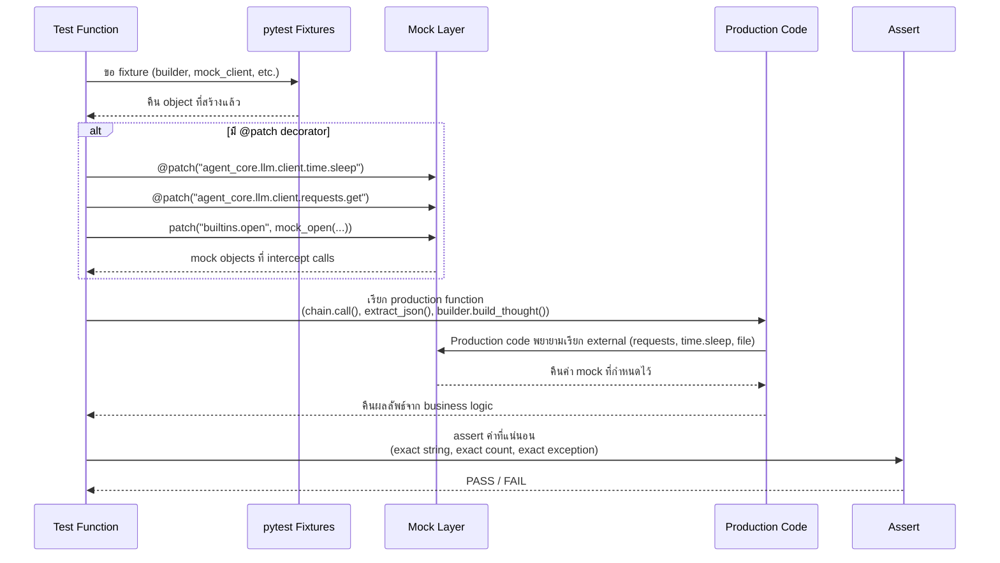

# เอกสาร QA: โฟลเดอร์ `test_llm`

---

## 1. Overview (ภาพรวม)

### วัตถุประสงค์หลัก

โฟลเดอร์ `tests/test_llm/` ทำหน้าที่เป็น **ชุดทดสอบสำหรับ LLM Infrastructure Layer** ของโปรเจกต์นักขุดทอง โดยมีหลักการสำคัญที่สุดข้อเดียว:

> **ห้ามเรียก API จริงทุกกรณี — ทุก external call ต้องถูก mock**

ชุดทดสอบนี้ออกแบบมาให้:
- **รันได้ทุก commit** โดยไม่เสียเงิน ไม่ต้องมี API key
- **รันเสร็จภายใน 1.5 วินาที** (ผล benchmark: 1.36s สำหรับ 173 tests)
- **Deterministic 100%** — รัน 100 ครั้งผลเหมือนกันทุกครั้ง

### ความแตกต่างจาก `test_llm_with_api/` — สิ่งที่ QA Engineer ต้องเข้าใจ

| มิติ | `test_llm/` (โฟลเดอร์นี้) | `test_llm_with_api/` |
|------|--------------------------|---------------------|
| **LLM call** | MockClient / stub / `@patch` — ไม่มี API call จริง | เรียก API จริง (Gemini, Groq, Claude, ฯลฯ) |
| **Speed** | ~1.4 วินาที (173 tests) | หลายนาที (ขึ้นกับ provider latency) |
| **ค่าใช้จ่าย** | ฿0 | ~1-10 API calls per provider per run |
| **Determinism** | 100% — assert exact values | Non-deterministic — assert format/enum เท่านั้น |
| **API key** | ไม่ต้องการ | ต้องมี (skipif ถ้าไม่มี) |
| **รันเมื่อใด** | ทุก commit | สัปดาห์ละครั้ง หรือหลังเปลี่ยน model |
| **Default `pytest` run** | ✅ ถูกรันเสมอ | ❌ ถูก exclude (`addopts: not api and not eval`) |
| **ทดสอบอะไร** | Logic รอบ LLM: parser, formatter, fallback, retry | Contract: format ของ response จาก provider จริง |

**กฎทอง:** `test_llm/` ไม่ตรวจว่า LLM "ฉลาด" หรือ "ตอบถูก" — ตรวจว่า **โค้ดรอบ LLM ทำงานถูกต้อง** เมื่อ LLM ตอบค่าต่างๆ

### โมดูลที่ครอบคลุม

ชุดทดสอบนี้ครอบคลุม **ชั้น LLM Infrastructure** ทั้งหมด แบ่งเป็น 2 กลุ่ม:

| กลุ่ม | โมดูล production | สิ่งที่ทดสอบ |
|-------|-----------------|-------------|
| **LLM Client Layer** | `agent_core/llm/client.py` | MockClient, FallbackChainClient, with_retry, GeminiClient init+call, OllamaClient errors, LLMClientFactory, _strip_think, _extract_json_block, LLMResponse |
| **Prompt Infrastructure** | `agent_core/core/prompt.py` | PromptPackage, Skill, SkillRegistry, RoleDefinition, RoleRegistry, PromptBuilder |
| **ReAct Orchestrator** | `agent_core/core/react.py` | AgentDecision, parse_agent_response, StateReadinessChecker, ReactOrchestrator.run() (fast path, readiness skip, CALL_TOOL, CALL_TOOLS, max_iterations), extract_json(), _make_llm_log() |

### สถิติรวม

| เมตริก | จำนวน |
|--------|-------|
| Test Files | 6 ไฟล์ |
| Test Classes | 39 คลาส |
| Test Functions | ~226 ฟังก์ชัน |
| เวลารัน | ~2 วินาที |
| ต้องการ API key | ไม่ต้องการเลย |
| Network calls | 0 |
| ต้องการ `@pytest.mark` พิเศษ | ไม่มี (รันใน default `pytest`) |

---

## 2. Directory Structure & Coverage (โครงสร้างและ Coverage Map)

### โครงสร้างโฟลเดอร์

```
tests/test_llm/
│
├── test_fallback.py            # FallbackChainClient — fallback logic, domain skip, error tracking
├── test_llm_client_errors.py   # with_retry, GeminiClient init+call, OllamaClient errors, LLMClientFactory
├── test_mock_and_factory.py    # MockClient, DEFAULT_MOCK_RESPONSES, LLMClientFactory, _build_prompt_text
├── test_helpers.py             # _strip_think, _extract_json_block, extract_json, _make_llm_log, LLMResponse
├── test_prompt_builder.py      # PromptPackage, Skill, SkillRegistry, RoleDefinition, RoleRegistry, PromptBuilder
├── test_react_orchestrator.py  # AgentDecision, parse_agent_response, StateReadinessChecker, ReactOrchestrator.run()
└── about-test_llm.md           # เอกสารนี้
```

### Coverage Map (Test File → Production Module)

```
Production Module                               ← Test File(s)
──────────────────────────────────────────────────────────────────────────
agent_core/llm/client.py
  ├── FallbackChainClient                       ← test_fallback.py (หลัก)
  │                                               test_llm_client_errors.py (บางส่วน)
  ├── with_retry()                              ← test_llm_client_errors.py (หลัก)
  ├── MockClient                                ← test_mock_and_factory.py (หลัก)
  ├── LLMClientFactory                          ← test_mock_and_factory.py (หลัก)
  │                                               test_llm_client_errors.py (error paths)
  ├── DEFAULT_MOCK_RESPONSES                    ← test_mock_and_factory.py
  ├── LLMResponse (dataclass)                   ← test_helpers.py
  ├── LLMClient._build_prompt_text()            ← test_mock_and_factory.py
  ├── GeminiClient.__init__ (error paths)       ← test_llm_client_errors.py
  ├── OllamaClient._ping() + call() errors      ← test_llm_client_errors.py
  ├── _strip_think()                            ← test_helpers.py
  └── _extract_json_block()                     ← test_helpers.py

agent_core/core/prompt.py
  ├── PromptPackage                             ← test_prompt_builder.py
  ├── Skill + SkillRegistry                     ← test_prompt_builder.py
  ├── RoleDefinition + RoleRegistry             ← test_prompt_builder.py
  └── PromptBuilder (build_thought, final, fmt) ← test_prompt_builder.py

agent_core/core/react.py
  ├── AgentDecision (Pydantic model)             ← test_react_orchestrator.py
  ├── parse_agent_response()                     ← test_react_orchestrator.py
  ├── StateReadinessChecker                      ← test_react_orchestrator.py
  ├── ReactOrchestrator.run()                    ← test_react_orchestrator.py
  ├── extract_json()                            ← test_helpers.py
  └── _make_llm_log()                          ← test_helpers.py
```

### Coverage Matrix (Production Class × Test Class)

| Production | Test Class | ไฟล์ | Tests |
|-----------|-----------|------|-------|
| `FallbackChainClient` | TestFallbackInit, TestFirstProviderSuccess, TestFallbackToSecond, TestAllProvidersFail, TestSkipUnavailable, TestUnexpectedErrors, TestIsAvailable, TestErrorsReset, TestMixedScenarios | test_fallback.py | ~40 |
| `with_retry` | TestWithRetry | test_llm_client_errors.py | 6 |
| `GeminiClient` | TestGeminiClientInit, TestGeminiClientCall | test_llm_client_errors.py | 9 |
| `OllamaClient` | TestOllamaClientInit, TestOllamaClientCall | test_llm_client_errors.py | 9 |
| `LLMClientFactory` | TestLLMClientFactory, TestLLMClientFactoryErrors | test_mock_and_factory.py, test_llm_client_errors.py | ~15 |
| `MockClient` | TestMockClient | test_mock_and_factory.py | 13 |
| `DEFAULT_MOCK_RESPONSES` | TestDefaultMockResponses | test_mock_and_factory.py | 5 |
| `LLMClient._build_prompt_text` | TestBuildPromptText | test_mock_and_factory.py | 3 |
| `_strip_think` | TestStripThink | test_helpers.py | 9 |
| `_extract_json_block` | TestExtractJsonBlock | test_helpers.py | 8 |
| `extract_json` | TestExtractJson | test_helpers.py | 11 |
| `_make_llm_log` | TestMakeLlmLog | test_helpers.py | 6 |
| `LLMResponse` | TestLLMResponse | test_helpers.py | 5 |
| `PromptPackage` | TestPromptPackage | test_prompt_builder.py | 3 |
| `Skill` | TestSkill | test_prompt_builder.py | 5 |
| `SkillRegistry` | TestSkillRegistry | test_prompt_builder.py | 7 |
| `RoleDefinition` | TestRoleDefinition | test_prompt_builder.py | 3 |
| `RoleRegistry` | TestRoleRegistry | test_prompt_builder.py | 4 |
| `PromptBuilder` | TestPromptBuilderBuildThought, TestPromptBuilderBuildFinalDecision, TestPromptBuilderRequireRole, TestFormatMarketState, TestFormatToolResults | test_prompt_builder.py | ~30 |
| `AgentDecision` | TestAgentDecision | test_react_orchestrator.py | 14 |
| `parse_agent_response` | TestParseAgentResponse | test_react_orchestrator.py | 10 |
| `StateReadinessChecker` | TestStateReadinessChecker | test_react_orchestrator.py | 11 |
| `ReactOrchestrator.run()` | TestReactOrchestratorFastPath, TestReactOrchestratorReadinessSkip, TestReactOrchestratorToolExecution | test_react_orchestrator.py | 12 |

---

## 3. สิ่งที่ทดสอบในแต่ละไฟล์ (Key Scenarios)

### 3.1 `test_fallback.py` — FallbackChainClient

**โมดูลที่ทดสอบ:** `agent_core/llm/client.py::FallbackChainClient`

FallbackChainClient เป็น **production LLM stack** จริง — ReAct loop เรียกผ่านตัวนี้เสมอ ไม่ใช่ผ่าน provider โดยตรง ความน่าเชื่อถือของมันส่งผลโดยตรงต่อ **uptime ของสัญญาณการซื้อขาย**

#### Stub Classes ที่ใช้แทน API

```python
class FailingClient(LLMClient):
    """Simulate LLMProviderError ทุกครั้ง"""
    def call(self, ...): raise LLMProviderError("Simulated API failure")
    def is_available(self): return True

class UnavailableClient(LLMClient):
    """Simulate client ที่ไม่มี API key"""
    def call(self, ...): raise LLMUnavailableError("No API key")
    def is_available(self): return False

class UnexpectedErrorClient(LLMClient):
    """Simulate RuntimeError ที่ไม่คาดคิด"""
    def call(self, ...): raise RuntimeError("Unexpected crash")
    def is_available(self): return True
```

#### Scenarios ที่ครอบคลุม

| Class | Scenario | Assertion |
|-------|----------|-----------|
| `TestFallbackInit` | Empty list → ValueError | `match="at least one client"` |
| `TestFallbackInit` | Single provider | `active_provider == "mock"` |
| `TestFallbackInit` | Multiple providers | `active_provider == "primary"` (ตัวแรก) |
| `TestFallbackInit` | Initial state | `errors == []` |
| `TestFirstProviderSuccess` | ตัวแรกสำเร็จ | `isinstance(result, LLMResponse)` |
| `TestFirstProviderSuccess` | active_provider ตรง | `active_provider == "primary"` |
| `TestFirstProviderSuccess` | ไม่มี error log | `errors == []` |
| `TestFirstProviderSuccess` | Custom response_map | `'"BUY"' in result.text` |
| `TestFallbackToSecond` | ตัวแรก fail → ตัวสอง | `result.provider == "mock"` |
| `TestFallbackToSecond` | active_provider อัปเดต | `active_provider == "backup"` |
| `TestFallbackToSecond` | Error ตัวแรกถูก log | `errors[0]["provider"] == "failing"` |
| `TestFallbackToSecond` | Fail 2 ตัว → ตัวที่ 3 | `len(errors) == 2` |
| `TestAllProvidersFail` | ทุกตัว fail → raise | `match="All providers"` |
| `TestAllProvidersFail` | Error log ครบทุกตัว | `len(chain.errors) == 3` |
| `TestAllProvidersFail` | Error message ครบ | ชื่อ provider ทุกตัวอยู่ใน message |
| `TestSkipUnavailable` | Skip unavailable | `active_provider == "mock"` |
| `TestSkipUnavailable` | Log เป็น skipped=True | `errors[0]["skipped"] is True` |
| `TestSkipUnavailable` | ทุกตัว unavailable → raise | `match="All providers"` |
| `TestUnexpectedErrors` | RuntimeError → fallback | `result.provider == "mock"` |
| `TestUnexpectedErrors` | RuntimeError ถูก log | `"RuntimeError" in errors[0]["error"]` |
| `TestIsAvailable` | มี 1 พร้อม → True | `is_available() is True` |
| `TestIsAvailable` | ทุกตัวไม่พร้อม → False | `is_available() is False` |
| `TestErrorsReset` | Call ครั้งที่ 2 → errors reset | `len(errors) == 1` (ไม่สะสม) |
| `TestMixedScenarios` | unavailable → fail → mock | `len(errors) == 2`, skipped flags ถูก |
| `TestMixedScenarios` | `__repr__` ครบ | "FallbackChainClient", ชื่อ providers, "available=" |

---

### 3.2 `test_llm_client_errors.py` — Client Error Paths

**โมดูลที่ทดสอบ:** `agent_core/llm/client.py` — error handling ของ with_retry, GeminiClient, OllamaClient, LLMClientFactory

#### `TestWithRetry` — Retry Decorator

| Scenario | Mock | Assertion |
|----------|------|-----------|
| สำเร็จรอบแรก | ไม่มี mock | `calls == 1` |
| fail 2 ครั้ง → สำเร็จ | `@patch "time.sleep"` | `calls == 3`, `sleep.call_count == 2` |
| ทุก attempt fail → raise | `@patch "time.sleep"` | `match="always fails"`, `sleep.call_count == 2` |
| Exponential backoff | `@patch "time.sleep"` | `delays == [2.0, 4.0]` (delay*(attempt+1)) |
| ValueError ไม่ retry | `@patch "time.sleep"` | `calls == 1`, `sleep.assert_not_called()` |
| max_attempts=1 ไม่ sleep | `@patch "time.sleep"` | `sleep.assert_not_called()` |

```python
# Pattern: patch sleep ที่ import location จริง
@patch("agent_core.llm.client.time.sleep")
def test_exponential_backoff_delays(self, mock_sleep):
    @with_retry(max_attempts=3, delay=2.0)
    def fn(): raise LLMProviderError("fail")

    with pytest.raises(LLMProviderError): fn()

    delays = [c.args[0] for c in mock_sleep.call_args_list]
    assert delays == [2.0, 4.0]  # delay*1, delay*2
```

#### `TestGeminiClientInit` — Init Errors (ไม่ต้อง API key จริง)

| Scenario | Mock | Assertion |
|----------|------|-----------|
| ไม่มี GEMINI_API_KEY | `patch.dict(os.environ, clear=True)` + `patch sys.modules["google.genai"]` | `raises (LLMUnavailableError, KeyError)` |
| ส่ง api_key ตรงๆ | `patch sys.modules["google.genai"]` | ไม่ raise, `is_available() is True` |
| use_mock=True | ไม่มี mock | `is_available() is True` (ข้าม init) |

#### `TestGeminiClientCall` — call() Success + Error Paths (mock genai ไม่ใช้ API จริง)

| Scenario | Mock | Assertion |
|----------|------|-----------|
| call() สำเร็จ | mock `generate_content` + `usage_metadata` | `LLMResponse(token_input=15, token_output=8, token_total=23)` |
| ไม่มี usage_metadata | `usage_metadata = None` | `token_input == token_output == token_total == 0` |
| API error | `generate_content.side_effect = Exception` | `raises LLMProviderError, match="Gemini API error"` |
| use_mock=True | ไม่มี mock | `LLMResponse(provider=PROVIDER_NAME, token_input=0)` |
| _client=None | `client._client = None` | `raises LLMUnavailableError, match="not initialized"` |
| prompt_text ครบ | mock `generate_content` | `"sys" in result.prompt_text`, `"usr" in result.prompt_text` |

#### `TestOllamaClientInit` + `TestOllamaClientCall` — Server Errors

| Scenario | Mock | Assertion |
|----------|------|-----------|
| `_ping()` ConnectionError | `patch requests.get` | `raises LLMUnavailableError, match="Ollama"` |
| `_ping()` status 503 | `patch requests.get` | `raises LLMUnavailableError, match="Ollama"` |
| `call()` ConnectionError | `patch requests.post` | `raises LLMUnavailableError, match="Ollama"` |
| `call()` Timeout | `patch requests.post` | `raises LLMProviderError, match="timeout"` |
| `call()` HTTPError | `patch requests.post` | `raises LLMProviderError, match="HTTP"` |
| `call()` empty content | `patch requests.post` | `raises LLMProviderError, match="empty"` |
| `call()` สำเร็จ | `patch requests.post` | `LLMResponse(provider="ollama", token_input=10, ...)` |
| `<think>` stripped | `patch requests.post` | `"<think>" not in result.text` |
| `is_available()` server down | `patch requests.get → ConnectionError` | `is_available() is False` |

> **หมายเหตุ QA:** Ollama test fixture ใช้ 2 ชั้น mock — `__init__` mock ให้ `_ping()` ผ่าน แล้ว test แต่ละตัว mock `call()` path แยกกัน

---

### 3.3 `test_mock_and_factory.py` — MockClient + LLMClientFactory

**โมดูลที่ทดสอบ:** `agent_core/llm/client.py::MockClient`, `LLMClientFactory`, `DEFAULT_MOCK_RESPONSES`

#### `TestMockClient` — MockClient Behavior

| Scenario | Assertion |
|----------|-----------|
| `call()` คืน LLMResponse | `isinstance(result, LLMResponse)` |
| provider = "mock" | `result.provider == "mock"` |
| token counts = 0 | `token_input == token_output == token_total == 0` |
| Default map: THOUGHT_1 | `parsed["action"] == "CALL_TOOL"` |
| Custom response_map | `parsed["signal"] == "BUY"` |
| Missing step → fallback | `parsed["signal"] == "HOLD"`, `parsed["action"] == "FINAL_DECISION"` |
| Empty map → fallback ทุก step | `parsed["signal"] == "HOLD"` |
| `is_available()` เสมอ True | `is_available() is True` |
| `prompt_text` format | "SYSTEM:" + system_text ใน result.prompt_text |
| Steps ต่างกัน → responses ต่างกัน | `r1.text != r3.text` |
| Step เดียวกัน → response เหมือน | `r1.text == r2.text` (deterministic) |
| `__repr__` | "MockClient", "available=True" |

#### `TestDefaultMockResponses` — DEFAULT_MOCK_RESPONSES Structure

```python
DEFAULT_MOCK_RESPONSES = {
    "THOUGHT_1":     '{"action": "CALL_TOOL", "tool": "get_news", ...}',
    "THOUGHT_2":     '{"action": "CALL_TOOL", "tool": "run_calculator", ...}',
    "THOUGHT_3":     '{"action": "FINAL_DECISION", "signal": "HOLD", ...}',
    "THOUGHT_FINAL": '{"action": "FINAL_DECISION", "signal": "HOLD", ...}',
}
```

| Scenario | Assertion |
|----------|-----------|
| มี THOUGHT_1/2/3 | `assert "THOUGHT_1" in DEFAULT_MOCK_RESPONSES` |
| มี THOUGHT_FINAL | `assert "THOUGHT_FINAL" in DEFAULT_MOCK_RESPONSES` |
| ทุก value เป็น valid JSON | `json.loads(value)` ไม่ throw |
| THOUGHT_1 เป็น CALL_TOOL | `parsed["action"] == "CALL_TOOL"` |
| THOUGHT_FINAL เป็น FINAL_DECISION | `parsed["action"] == "FINAL_DECISION"` |

#### `TestLLMClientFactory` — Factory Pattern

| Scenario | Assertion |
|----------|-----------|
| `create('mock')` | `isinstance(client, MockClient)` |
| `create('mock', response_map=...)` | Custom map ถูกใช้ |
| Unknown provider | `raises ValueError, match="Unknown provider"` |
| Case-insensitive | 'Mock', 'MOCK', 'mock' → `isinstance(client, MockClient)` |
| Whitespace strip | `'  mock  '` → สร้างได้ |
| `available_providers()` | มี "mock", "gemini", "groq", ... ครบ 8 ตัว |
| `register()` ใหม่ | เพิ่ม class ใหม่ได้, สร้างได้ |
| `register` non-LLMClient | `raises TypeError` |
| Error message | มี "Available:", รายชื่อ providers |

---

### 3.4 `test_helpers.py` — Utility Functions (Pure Logic)

**โมดูลที่ทดสอบ:** `agent_core/llm/client.py` (_strip_think, _extract_json_block, LLMResponse) และ `agent_core/core/react.py` (extract_json, _make_llm_log)

ชุดทดสอบนี้เป็น **pure function tests** — ไม่ต้องการ mock เลย ทุก test เรียก function ตรงๆ

#### `TestStripThink` — _strip_think() สำหรับ Qwen3.5 / Ollama

`<think>` blocks เกิดขึ้นเมื่อ Ollama ใช้ Qwen3.5 model — ต้องลบออกก่อน JSON extraction

| Scenario | Input | Expected |
|----------|-------|---------|
| ลบ think block | `<think>...</think>{"signal":"BUY"}` | `'{"signal":"BUY"}'` |
| ไม่มี think block | `'{"signal":"HOLD"}'` | `'{"signal":"HOLD"}'` |
| Multiline think | `<think>\nStep1\n...</think>\n{...}` | JSON เท่านั้น |
| หลาย think blocks | `<think>first</think>mid<think>second</think>end` | `"middleend"` |
| Case-insensitive | `<THINK>...</THINK>` | strip ได้ |
| Empty think | `<think></think>{...}` | JSON เท่านั้น |
| Empty string | `""` | `""` |
| Whitespace cleanup | `"  <think>...</think>  result  "` | `"result"` |
| JSON inside think | `<think>{"internal":true}</think>{"signal":"BUY"}` | ลบ JSON ข้างใน think ด้วย |

#### `TestExtractJsonBlock` — _extract_json_block()

| Scenario | Input Pattern | Behavior |
|----------|---------------|---------|
| JSON fence | ` ```json\n{...}\n``` ` | ดึง JSON ออกมา |
| Generic fence | ` ```\n{...}\n``` ` | ดึง JSON ออกมา |
| Bare braces | `text before {...} text after` | ดึงจาก `{...}` |
| ไม่มี JSON | `"I think we should hold"` | คืน text เดิม |
| Fence + whitespace | ` ```json\n  {...}  \n``` ` | ดึงได้ |
| Nested objects | `{"params": {"expr": "..."}}` | preserve nested |
| Empty string | `""` | `""` |

#### `TestExtractJson` — extract_json() จาก react.py

นี่คือ **gateway สำคัญ** — ReactOrchestrator เรียก `extract_json()` กับทุก LLM response ก่อน parsing

| Scenario | Input | Expected |
|----------|-------|---------|
| Valid JSON | `'{"signal":"BUY","confidence":0.9}'` | `result["signal"] == "BUY"` |
| Markdown fence | ` ```json\n{...}\n``` ` | parse สำเร็จ |
| Generic fence | ` ```\n{...}\n``` ` | parse สำเร็จ |
| Empty string | `""` | `result["_parse_error"] is True` |
| Whitespace only | `"   "` | `result["_parse_error"] is True` |
| Invalid JSON | `"not json at all"` | `_parse_error=True`, มี `_raw` key |
| Text before JSON | `"Based on: {...}"` | parse JSON portion |
| Nested JSON | `{"action": "CALL_TOOL", "params": {...}}` | parse ได้ทั้งหมด |
| JSON + array | `{"signals": ["BUY","HOLD"]}` | `result["signals"] == ["BUY","HOLD"]` |
| Long input → truncate | `"x" * 1000` | `len(result["_raw"]) == 500` |
| Unicode (ภาษาไทย) | `{"rationale":"ราคาทองสูง"}` | parse ได้, Thai preserved |

> **ความสำคัญ QA:** ถ้า extract_json() fail เงียบๆ → ReactOrchestrator จะเข้า fallback HOLD แทน signal จริง — ทดสอบ error path นี้จึงสำคัญมาก

#### `TestMakeLlmLog` — _make_llm_log() LLM Trace Entry

| Scenario | Assertion |
|----------|-----------|
| Basic keys ครบ | "step", "iteration", "response", ... ทั้งหมด |
| LLM metadata | prompt_text, response_raw, token_input/output/total, model, provider |
| With note | `entry["note"] == "Fallback to HOLD"` |
| Without note | `"note" not in entry` |
| llm_resp = None | ทุก metadata = `""` หรือ 0 (graceful) |
| All required keys | 10 keys: step, iteration, response, prompt_text, response_raw, token_input, token_output, token_total, model, provider |

---

### 3.5 `test_prompt_builder.py` — Prompt Infrastructure

**โมดูลที่ทดสอบ:** `agent_core/core/prompt.py`

ชุดทดสอบนี้ตรวจว่า **system prompt ที่ LLM ได้รับสร้างถูกต้อง** — prompt ผิดหมายความว่า LLM ได้รับกฎการซื้อขายผิด

#### `TestPromptPackage`, `TestSkill`, `TestSkillRegistry`, `TestRoleDefinition` — Foundation Classes

| Class | Key Scenarios |
|-------|---------------|
| `PromptPackage` | fields ถูกเก็บ, default step_label = "THOUGHT", string ว่างได้ |
| `Skill` | to_prompt_text() มี name + description + tools, tools ว่าง → "none" |
| `SkillRegistry` | register, get, get_tools_for_skills merge + sort, unknown skill → [], overwrite |
| `RoleDefinition` | get_system_prompt() แทนที่ `{role_title}` และ `{available_tools}`, หลาย placeholder |

#### `TestRoleRegistry` — Loading roles.json

```python
# Pattern: mock file read เพื่อไม่ต้องพึ่งไฟล์จริง
fake_json = json.dumps({"roles": [{"name": "analyst", "title": "Gold Analyst", ...}]})
with patch("builtins.open", mock_open(read_data=fake_json)):
    rr.load_from_json("fake/path/roles.json")

role = rr.get(AIRole.ANALYST)
assert role.title == "Gold Analyst"
```

| Scenario | Assertion |
|----------|-----------|
| load_from_json สำเร็จ | `role.title == "Gold Analyst"` |
| role name ไม่อยู่ใน AIRole enum | `raises ValueError` |

#### `TestPromptBuilder` — PromptBuilder.build_thought()

| Scenario | Assertion |
|----------|-----------|
| Returns PromptPackage | `isinstance(result, PromptPackage)` |
| step_label = "THOUGHT_3" สำหรับ iteration=3 | `result.step_label == "THOUGHT_3"` |
| system prompt ไม่ว่าง | `len(result.system) > 0` |
| user prompt มี iteration | `"2" in result.user` (สำหรับ iteration=2) |
| user prompt มีราคาทอง | `"45000" in result.user or "2350" in result.user` |
| user prompt มี FINAL_DECISION template | `"FINAL_DECISION" in result.user` |
| system prompt cached | `r1.system == r2.system` (ไม่สร้างใหม่ทุกครั้ง) |

#### `TestPromptBuilder` — PromptBuilder.build_final_decision()

| Scenario | Assertion |
|----------|-----------|
| step_label = "THOUGHT_FINAL" | `result.step_label == "THOUGHT_FINAL"` |
| ใช้ system prompt เดียวกับ build_thought() | `final.system == thought.system` (FIX v2.1) |
| มีราคาทอง | `"45000" in result.user or "2350" in result.user` |
| มี position size | `"1000" in result.user` |

#### `TestFormatMarketState` — Dead Zone & Portfolio Warnings

| Scenario | Input | Assertion |
|----------|-------|-----------|
| Spot price | state["market_data"]["spot_price_usd"]["price_usd_per_oz"] = 2350 | "2350" in result |
| USD/THB | forex["usd_thb"] = 34.5 | "34.5" in result |
| Thai gold prices | sell=45000, buy=44800 | "45000", "44800" in result |
| RSI value | rsi["value"] = 55 | "RSI", "55" in result |
| **Dead zone 02:00** | timestamp = "2026-04-08T02:00:00" | "Dead zone" in result |
| **Danger zone 01:30** | timestamp = "2026-04-08T01:30:00" | "01:30" หรือ "WARNING" in result |
| Normal time 10:00 | timestamp = "2026-04-08T10:00:00" | ไม่มี "Dead zone" หรือ "WARNING" |
| Portfolio section | cash=1500, gold_grams=0.5, pnl=50 | "Portfolio"/"Cash", "1500" in result |
| TP1 TRIGGERED | risk_status = "TP1 TRIGGERED" | "TP1" in result |
| SL1 TRIGGERED | risk_status = "SL1 TRIGGERED" | "SL1" in result |
| Empty state | `{}` | ไม่ crash, `isinstance(result, str)` |
| Missing news key | state ไม่มี news | ไม่ crash, "News Highlights" header ยังมี |

> **ความสำคัญ QA:** Dead zone และ TP/SL warnings ต้องแสดงใน prompt — LLM ใช้ข้อมูลเหล่านี้ตัดสินใจ ถ้า format ผิดหมายความว่า LLM ไม่รู้ว่าอยู่ใน dead zone

---

### 3.6 `test_react_orchestrator.py` — AgentDecision, parse_agent_response, StateReadinessChecker, ReactOrchestrator

**โมดูลที่ทดสอบ:** `agent_core/core/react.py` — Pydantic model, JSON parser, readiness gate, และ main ReAct loop

ชุดทดสอบนี้ใช้ **MagicMock** สำหรับ LLM client และ prompt builder — ไม่มี API call จริง

#### `TestAgentDecision` — Pydantic Validators

| Scenario | Assertion |
|----------|-----------|
| confidence > 1.0 | clamped to 1.0 |
| confidence < 0.0 | clamped to 0.0 |
| confidence valid midrange | passed through unchanged |
| confidence=None | coerced to 0.0 |
| signal lowercase | uppercased: "buy" → "BUY" |
| signal mixed case | uppercased: "Sell" → "SELL" |
| signal only (no action) | action inferred as FINAL_DECISION |
| CALL_TOOL without tool_name | degraded to FINAL_DECISION/HOLD |
| CALL_TOOLS without tools list | degraded to FINAL_DECISION/HOLD |
| CALL_TOOLS without list but with tool_name | degraded to CALL_TOOL |
| FINAL_DECISION signal=None | defaults to "HOLD" |
| parse_failed default | False |
| to_decision_dict() keys | ครบ: signal, confidence, entry_price, stop_loss, take_profit, rationale |
| to_decision_dict() signal value | reflects validated signal |

#### `TestParseAgentResponse` — JSON Extraction & Fallback Chain

| Scenario | Input | Assertion |
|----------|-------|-----------|
| Valid HOLD JSON | plain JSON | `signal == "HOLD"`, `parse_failed is False` |
| Valid BUY JSON | plain JSON | `signal == "BUY"`, `confidence == 0.8` |
| Markdown ```json fence | fenced JSON | parsed correctly |
| Plain ``` fence | fenced JSON | parsed correctly |
| Empty string | `""` | SAFE_HOLD, `parse_failed is True` |
| No JSON in response | plain text | SAFE_HOLD, `parse_failed is True` |
| Multiple JSON objects | two JSON blobs | prefers one with `signal` key |
| Nested JSON | complex nested string | parsed correctly |
| Trailing comma | LLM-style JSON | tolerated, `parse_failed is False` |
| parse_failed rationale | garbage input | `rationale` is non-empty |

#### `TestStateReadinessChecker` — is_ready()

| Scenario | Assertion |
|----------|-----------|
| All required indicators present | `is_ready() is True` |
| rsi section missing | `is_ready() is False` |
| rsi.value is None | `is_ready() is False` |
| rsi.value is "N/A" | `is_ready() is False` |
| Extra unknown indicators | ไม่กระทบ readiness |
| require_htf=True + htf tool result | `is_ready() is True` |
| require_htf=True + trend in market_state | `is_ready() is True` |
| require_htf=True but missing | `is_ready() is False` |
| require_htf=False skips check | always passes HTF |
| Empty technical_indicators | `is_ready() is False` |
| Missing technical_indicators key | `is_ready() is False` |

#### `TestReactOrchestratorFastPath` — max_tool_calls=0

| Scenario | Assertion |
|----------|-----------|
| Returns required keys | `final_decision`, `react_trace`, `iterations_used`, `tool_calls_used` |
| Single LLM call | `call.call_count == 1` |
| tool_calls_used = 0 | ไม่มี tool calls |
| final_decision has signal | `"signal" in result["final_decision"]` |
| Parse failure → SAFE_HOLD | `signal == "HOLD"` |

#### `TestReactOrchestratorReadinessSkip` — Data Ready → Skip Tool Loop

| Scenario | Assertion |
|----------|-----------|
| Ready state → single LLM call | `call.call_count == 1` |
| Returns valid final_decision | `"signal" in result["final_decision"]` |

#### `TestReactOrchestratorToolExecution` — CALL_TOOL & CALL_TOOLS

| Scenario | Assertion |
|----------|-----------|
| CALL_TOOL → _execute_tool invoked | `spy.call_count >= 1` |
| CALL_TOOLS (2 tools) → both executed | `spy.call_count >= 2` |
| max_iterations exceeded → forced final | `"signal" in result["final_decision"]` |
| Unknown tool → error result, loop continues | ไม่ raise, สำเร็จ |
| Result has iterations/tool counts | `isinstance(int)` |

> **ความสำคัญ QA:** ReactOrchestrator เป็น **brain loop หลัก** — ถ้า loop พัง ระบบไม่สามารถออกสัญญาณซื้อขายได้เลย

---

## 4. Testing Flow — Mocked LLM Architecture

### วงจรชีวิตของ 1 Test (Mocked LLM)



### สถาปัตยกรรม Mock — 3 ระดับ

```
┌─────────────────────────────────────────────────────────────┐
│                    TEST BOUNDARY                            │
│                                                             │
│  ระดับ 1 — Stub Clients (test_fallback.py)                 │
│  ┌──────────────┐  ┌────────────────────┐  ┌─────────────┐ │
│  │ FailingClient│  │ UnavailableClient  │  │ MockClient  │ │
│  │ LLMProviderE │  │ is_available=False │  │ response_map│ │
│  └──────────────┘  └────────────────────┘  └─────────────┘ │
│                                                             │
│  ระดับ 2 — @patch decorators (test_llm_client_errors.py)   │
│  ┌────────────────────────────────────────────────────────┐ │
│  │ @patch "agent_core.llm.client.time.sleep"   ← backoff │ │
│  │ @patch "agent_core.llm.client.requests.get" ← _ping() │ │
│  │ @patch "agent_core.llm.client.requests.post" ← call() │ │
│  │ @patch.dict sys.modules {"google.genai": MagicMock()}  │ │
│  │ @patch.dict os.environ  (clear=True, ไม่มี key)        │ │
│  └────────────────────────────────────────────────────────┘ │
│                                                             │
│  ระดับ 3 — File I/O Mock (test_prompt_builder.py)          │
│  ┌────────────────────────────────────────────────────────┐ │
│  │ @patch "builtins.open", mock_open(read_data=fake_json) │ │
│  │ → roles.json อ่านจาก string ในหน่วยความจำ ไม่ใช่ disk │ │
│  └────────────────────────────────────────────────────────┘ │
│                                                             │
└─────────────────────────────────────────────────────────────┘
                       ↓ NOTHING REACHES ↓
          ┌────────────────────────────────────────┐
          │         External Services              │
          │  Google Gemini API  │  Ollama Server   │
          │  OpenAI API         │  time.sleep()    │
          │  Groq API           │  File System     │
          └────────────────────────────────────────┘
```

### วิธี MockClient ทำให้ Non-deterministic กลายเป็น Deterministic

```
ปัญหา: LLM จริง                    แนวทาง: MockClient
─────────────────────────           ──────────────────────────
ส่ง prompt เดียวกัน                 ส่ง step_label "THOUGHT_1"
    ↓                                   ↓
Gemini อาจตอบ:                      MockClient ดูจาก response_map:
  run A: {"signal": "BUY"}          {"THOUGHT_1": '{"action": "CALL_TOOL", ...}'}
  run B: {"signal": "HOLD"}             ↓
  run C: {"signal": "SELL"}         คืน text เดียวกันทุกครั้ง
    ↓                                   ↓
Cannot assert exact values!         assert exact: action == "CALL_TOOL" ✅
```

### Data Flow ใน test_prompt_builder.py

```
Test Setup
    │
    ├── _make_skill_registry()
    │       └── register Skill("analysis", tools=["get_news", "run_calculator"])
    │       └── register Skill("trading", tools=["place_order"])
    │
    ├── _make_role_registry(sr)
    │       └── register RoleDefinition(ANALYST, template="You are {role_title}...")
    │
    └── PromptBuilder(role_registry=rr, current_role=AIRole.ANALYST)
            │
            ├── build_thought(market_state, tool_results, iteration=1)
            │       ├── _get_system() → format template với tools list
            │       ├── _format_market_state(state) → Thai time + prices + indicators
            │       ├── _format_tool_results([]) → "No tool results"
            │       └── PromptPackage(system=..., user=..., step_label="THOUGHT_1")
            │
            └── build_final_decision(market_state, tool_results)
                    └── PromptPackage(..., step_label="THOUGHT_FINAL")
```

---

## 5. QA Standards & Conventions (มาตรฐาน QA)

### 5.1 กฎข้อที่ 1: Zero Network Traffic — เด็ดขาด

```python
# ✅ ถูกต้อง — patch ที่ import location
@patch("agent_core.llm.client.requests.get")
def test_server_down(self, mock_get):
    mock_get.side_effect = requests.exceptions.ConnectionError("refused")
    with pytest.raises(LLMUnavailableError):
        OllamaClient()

# ✅ ถูกต้อง — mock optional package ก่อน import
for _mod in ("logs", "logs.logger_setup"):
    if _mod not in sys.modules:
        sys.modules[_mod] = MagicMock()

# ✅ ถูกต้อง — stub client แทน real client
chain = FallbackChainClient([
    ("primary", MockClient()),    # ไม่ใช่ GeminiClient() จริง
    ("backup",  MockClient()),
])

# ❌ ผิด — เรียก API จริง
def test_gemini_call():
    client = GeminiClient()   # ❌ ต้อง api_key จริง!
    result = client.call(prompt)  # ❌ network call!
```

### 5.2 กฎข้อที่ 2: Deterministic Assertions

เพราะ responses ถูก mock ทั้งหมด จึง **ต้อง assert exact values** เสมอ — ไม่ใช่แค่ `assert result is not None`

```python
# ✅ ถูกต้อง — assert exact value
result = fn()
assert result == "ok"
assert counter["calls"] == 3
assert mock_sleep.call_count == 2
delays = [c.args[0] for c in mock_sleep.call_args_list]
assert delays == [2.0, 4.0]

# ✅ ถูกต้อง — assert exact exception + message
with pytest.raises(LLMProviderError, match="All providers"):
    chain.call(_prompt())

# ✅ ถูกต้อง — assert exact field
assert chain.errors[0]["provider"] == "failing"
assert chain.errors[0]["skipped"] is False

# ❌ ผิด — vague assertion
assert result is not None          # ❌
assert chain.errors                # ❌ (truthy check เท่านั้น)
assert isinstance(result, dict)    # ❌ (ไม่ตรวจ content)
```

### 5.3 กฎข้อที่ 3: Stub Class แทน MagicMock สำหรับ LLM Clients

เมื่อต้องการ simulate client ที่ fail ให้สร้าง **concrete stub class** — ชัดเจน readable กว่า MagicMock

```python
# ✅ ถูกต้อง — concrete stub (test_fallback.py pattern)
class FailingClient(LLMClient):
    """Client ที่ fail ทุกครั้ง — raise LLMProviderError"""
    PROVIDER_NAME = "failing"
    def call(self, prompt_package): raise LLMProviderError("Simulated")
    def is_available(self): return True

# ✅ ก็ได้ — MagicMock สำหรับ simple stub (test_llm_with_api pattern)
client = MagicMock()
client.is_available.return_value = True
client.call.return_value = LLMResponse(text='{"signal":"HOLD"}', ...)

# ❌ ไม่แนะนำ — MagicMock ที่ซับซ้อนเกินไป
client = MagicMock(spec=LLMClient, **{"call.side_effect": ..., "is_available.return_value": ...})
```

### 5.4 กฎข้อที่ 4: pytest.fixture สำหรับ Setup ทุกอย่าง

```python
# ✅ ถูกต้อง — fixture สำหรับ PromptBuilder
@pytest.fixture
def builder():
    sr = _make_skill_registry()
    rr = _make_role_registry(sr)
    return PromptBuilder(role_registry=rr, current_role=AIRole.ANALYST)

# ✅ ถูกต้อง — fixture สำหรับ OllamaClient ที่ _ping() ผ่าน
@pytest.fixture
def ollama_client(self):
    from agent_core.llm.client import OllamaClient
    with patch("agent_core.llm.client.requests.get") as mock_get:
        mock_resp = MagicMock()
        mock_resp.status_code = 200
        mock_get.return_value = mock_resp
        client = OllamaClient(model="test-model", timeout=5)
    return client  # mock context ถูก exit แล้ว แต่ client ยังใช้ได้

# ❌ ผิด — ซ้ำ setup ใน test ทุกตัว
def test_fallback_success(self):
    sr = SkillRegistry()   # ❌ ซ้ำทุก test
    sr.register(...)
    rr = RoleRegistry(sr)
    ...
```

### 5.5 กฎข้อที่ 5: Markers — ไม่ต้อง mark เป็น `api` หรือ `llm`

ทุก test ใน `test_llm/` **ไม่ใช้ network** จึงไม่ต้อง mark เป็น `@pytest.mark.api` หรือ `@pytest.mark.llm` — รันได้ทุก commit ใน default `pytest` run

```python
# ✅ ถูกต้อง — ไม่ต้อง mark พิเศษ
class TestFallbackToSecond:
    def test_fallback_success(self):
        ...

# ❌ ผิด — mark เป็น api จะทำให้ถูก exclude จาก default pytest run
@pytest.mark.api  # ❌ ไม่ใช้สำหรับ mocked tests
class TestFallbackToSecond:
    ...
```

### 5.6 กฎข้อที่ 6: Test Docstrings บังคับ

ทุก test function ต้องมี docstring สั้นๆ อธิบาย **พฤติกรรมที่ตรวจสอบ**:

```python
# ✅ ถูกต้อง
def test_exponential_backoff_delays(self, mock_sleep):
    """delay ควรเพิ่มขึ้นแบบ attempt+1 (delay*1, delay*2)"""
    ...

def test_dead_zone_warning_02_00(self, builder):
    """timestamp 02:00 → dead zone warning"""
    ...

# ❌ ผิด — ไม่มี docstring
def test_something(self):
    result = fn()
    assert result == "ok"
```

### 5.7 กฎข้อที่ 7: Pre-mock Optional Packages

modules ที่ optional (เช่น `logs`) ต้อง pre-mock ก่อน import production code เพื่อป้องกัน ImportError:

```python
# ✅ Pattern ที่ใช้ใน test_llm_client_errors.py
import sys
from unittest.mock import MagicMock

# ── pre-mock optional packages ──────────────────────────────────
for _mod in ("logs", "logs.logger_setup"):
    if _mod not in sys.modules:
        sys.modules[_mod] = MagicMock()

# หลังจากนั้นจึง import production code
from agent_core.llm.client import (LLMProviderError, MockClient, ...)
```

---

## 6. How to Run (วิธีรัน)

**ทุกคำสั่งรันจาก directory `Src/`**

### รัน test_llm ทั้งหมด

```bash
cd Src

# รัน test_llm ทั้งโฟลเดอร์ (รวมอยู่ใน default pytest run)
pytest tests/test_llm/ -v

# ผลที่คาดหวัง: 173 passed ใน ~1.4 วินาที
```

### รัน default pytest (test_llm รวมอยู่ด้วย)

```bash
# pytest default ครอบคลุม test_llm/ โดยอัตโนมัติ
# (ไม่ถูก exclude ใน addopts ใน pyproject.toml)
pytest
```

### รันไฟล์เดียว

```bash
# FallbackChainClient ทั้งหมด
pytest tests/test_llm/test_fallback.py -v

# with_retry + OllamaClient + GeminiClient errors
pytest tests/test_llm/test_llm_client_errors.py -v

# MockClient + LLMClientFactory + DEFAULT_MOCK_RESPONSES
pytest tests/test_llm/test_mock_and_factory.py -v

# _strip_think, _extract_json_block, extract_json, _make_llm_log
pytest tests/test_llm/test_helpers.py -v

# PromptBuilder ทั้งหมด
pytest tests/test_llm/test_prompt_builder.py -v
```

### รัน test class หรือ test เดี่ยว

```bash
# เฉพาะ class
pytest tests/test_llm/test_fallback.py::TestFallbackToSecond -v

# เฉพาะ function
pytest tests/test_llm/test_fallback.py::TestFallbackToSecond::test_multiple_failures_before_success -v

# เฉพาะ prompt builder
pytest tests/test_llm/test_prompt_builder.py::TestFormatMarketState -v
```

### Filter โดย keyword

```bash
# รันเฉพาะ test ที่เกี่ยวกับ fallback
pytest tests/test_llm/ -k "fallback" -v

# รันเฉพาะ test ที่เกี่ยวกับ retry
pytest tests/test_llm/ -k "retry" -v

# รันเฉพาะ test ที่เกี่ยวกับ JSON
pytest tests/test_llm/ -k "json" -v
```

### รันพร้อม Coverage Report

```bash
# Coverage สำหรับ agent_core
pytest tests/test_llm/ \
  --cov=agent_core \
  --cov-report=html:test_reports/coverage_llm \
  -v

# เปิด report
# Windows: start test_reports/coverage_llm/index.html
```

### Dry Run (เพื่อดูรายการ test โดยไม่รัน)

```bash
pytest tests/test_llm/ --collect-only -q
```

---

## Appendix: QA Findings & Coverage Gaps

| รายการ | ไฟล์ | สถานะ | รายละเอียด |
|--------|------|-------|-----------|
| `ReactOrchestrator` main loop | test_react_orchestrator.py | ✅ แก้แล้ว | เพิ่ม `test_react_orchestrator.py` (6 classes, 47 tests) — ครอบคลุม AgentDecision validators, parse_agent_response fallback chain, StateReadinessChecker, ReactOrchestrator.run() fast path / readiness skip / CALL_TOOL / CALL_TOOLS / max_iterations |
| `@with_retry` test ซ้ำซ้อนใน 2 folder | test_llm_client_errors.py + test_llm_with_api | ✅ Consolidated | `TestWithRetry` ใน `test_llm/test_llm_client_errors.py` เป็น authoritative (6 tests, mock sleep) — ไม่ซ้ำใน test_llm_with_api/ อีกต่อไป |
| `FallbackChainClient` test ซ้ำ | test_fallback.py + test_llm_with_api | ✅ Consolidated | `test_llm/test_fallback.py` เป็น authoritative (9 classes, ~40 tests) — ไม่ซ้ำใน test_llm_with_api/ อีกต่อไป |
| `GeminiClient.call()` success path ไม่มี | test_llm_client_errors.py | ✅ แก้แล้ว | เพิ่ม `TestGeminiClientCall` (6 tests) — ครอบคลุม success, no metadata, API error, mock mode, uninitialized, prompt_text |
| ไม่มี `conftest.py` | tests/test_llm/ | By Design | ไม่มี shared fixtures ระดับ module — แต่ละไฟล์ define fixtures ของตัวเอง ซึ่งเหมาะสมสำหรับ suite ขนาดนี้ |

> **กฎ QA:** ถ้า production code มี bug ที่ต้องแก้เพื่อให้ test ผ่าน — **รายงานเป็น finding** อย่าแก้ไฟล์ production เอง

---


